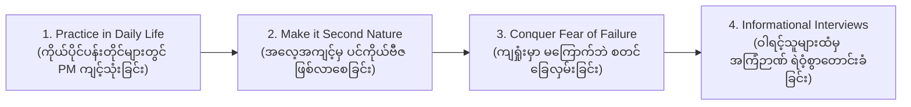

# Lesson 1.11: Gilbert: Project Management Skills in My Role
*(Gilbert ၏ အတွေ့အကြုံ - လုပ်ငန်းခွင်အတွင်း PM စွမ်းရည်များကို အသုံးချပုံ)*

- **Course:** Google Project Management Certificate - Course 1: Foundations of Project Management
- **Module:** Module 1 - Embarking on a career in project management
- **Speaker:** Gilbert (Talent Outreach Specialist at Google)
- **Topic:** Talent Outreach at Google, Wearing the PM Hat, Transferable Skills from Big Box Retail, Difficult Conversations, Personal Practice as Second Nature, Overcoming Imposter Syndrome, Informational Interviews & Asking for Help

---

## 📌 ၁။ အနှစ်ချုပ် မှတ်စု (Quick Summary & Key Takeaways)

::: tip 💡 မျက်စိထဲ တစ်ချက်ကြည့်ရုံဖြင့် မှတ်သားနိုင်သော အနှစ်ချုပ်
- **Google တွင် မည်သည့် ရာထူးဖြစ်စေ PM ဦးထုပ်ကို ဆောင်းရခြင်း (Wearing the PM Hat at Google):** Google တွင် တရားဝင် ရာထူးနာမည်က "Project Manager" မဟုတ်စေကာမူ အခန်းကဏ္ဍတိုင်းနီးပါးတွင် Program နှင့် Project Management ဦးထုပ်ကို ဆောင်းရပါသည် (PM စွမ်းရည်များကို နေ့စဉ် မဖြစ်မနေ အသုံးချရပါသည်)။
- **Talent Outreach ၏ အခန်းကဏ္ဍ:** Google သို့ ဝင်ရောက်လုပ်ကိုင်ရန် ယခင်က စိတ်ကူးပင် မယဉ်ဖူးသော နယ်ပယ်ပေါင်းစုံမှ အရည်အချင်းရှိသူများ (Underrepresented talent) ကို ရှာဖွေဆက်သွယ်ပေးခြင်းနှင့် အင်တာဗျူး အဆင့်ဆင့်ကို အောင်မြင်စွာ ဖြတ်သန်းနိုင်ရန် လမ်းပြကူညီပေးခြင်း ဖြစ်သည်။
- **လက်လီအရောင်းဆိုင် (Big Box Retailer) မှ ရရှိခဲ့သော တန်ဖိုးရှိသည့် PM စွမ်းရည်များ:**
  - ကောလိပ်ဆင်းစ ပထမဆုံးအလုပ်မှာ ကုန်တိုက်ကြီးတစ်ခု၏ လက်ထောက်မန်နေဂျာ (Assistant Manager at a Big Box Retailer) ဖြစ်ခဲ့သည်။
  - ထိုအလုပ်မှ ရရှိခဲ့သော စွမ်းရည်များဖြစ်သည့် - **ခက်ခဲသော စကားဝိုင်းများကို ပြောဆိုနိုင်စွမ်း (Difficult conversations)**၊ **ဘတ်ဂျက် ထိန်းချုပ်ခြင်း**၊ **အရင်းအမြစ် စီမံခန့်ခွဲခြင်း** နှင့် **အချိန် စီမံခန့်ခွဲခြင်း** တို့သည် Google သို့ ရောက်ရှိချိန်တွင် ကြီးမားသော အထောက်အကူ ဖြစ်စေခဲ့သည်။
- **ကိုယ်ပိုင် ပရောဂျက်များတွင် လေ့ကျင့်ခြင်းမှ ပင်ကိုယ်ဗီဇ (Second Nature) ဖြစ်လာပုံ:**
  - Gilbert သည် မိမိ၏ ၃ လတာ ကိုယ်ပိုင်ရည်မှန်းချက်များအတွက် Project Plan ဆွဲခြင်းကဲ့သို့သော သေးငယ်သည့် ကိစ္စများတွင်ပင် PM Framework များကို စတင်ကျင့်သုံးခဲ့သည်။
  - ထိုသို့ အမြဲလေ့ကျင့်ထားသောကြောင့် Google တွင် Stakeholders များစွာ၊ Timeline မျိုးစုံနှင့် **ပြိုင်ဆိုင်နေသော ဦးစားပေးများ (Competing priorities)** ကို ရင်ဆိုင်ရချိန်တွင် လုံးဝ စိုးရိမ်စရာမလိုဘဲ ပင်ကိုယ်ဗီဇကဲ့သို့ (Second nature) သဘာဝကျစွာ ကိုင်တွယ်နိုင်ခဲ့သည်။
- **Imposter Syndrome ကို ကျော်လွှားနိုင်သည့် နည်းလမ်း:** မိမိအရည်အချင်းအပေါ် သံသယဝင်ခြင်း (Imposter syndrome) နှင့် ယုံကြည်မှု အားနည်းခြင်းကို ကုစားနိုင်သည့် တစ်ခုတည်းသော သော့ချက်မှာ **"လက်တွေ့ အကြိမ်ကြိမ် လေ့ကျင့်ခြင်း (Deliberate Practice)"** သာ ဖြစ်သည်။
- **အကူအညီ တောင်းခံရန် မကြောက်ပါနှင့် (Ask for Help & Informational Interviews):**
  - လူအများစုသည် အမှန်တကယ် ကူညီလိုစိတ် ရှိကြသည်။
  - မိမိ စိတ်ဝင်စားသော နယ်ပယ်မှ ဝါရင့်ပညာရှင်များနှင့် ချိတ်ဆက်ကာ **Informational Interview (လေ့လာစူးစမ်းရေး စကားဝိုင်း)** များ ပြုလုပ်ပါ၊ Resume အကြံဉာဏ်များ တောင်းခံပါ။
  - စူးစမ်းလိုစိတ်ရှိသူ (Curious)၊ ထိုးထွင်းဉာဏ်ရှိသူ (Intuitive) နှင့် သင်ယူလိုစိတ် ပြင်းပြသူများကို လူတိုင်းက ကူညီလမ်းပြလိုကြသည်။
:::

---

## 📖 ၂။ အပြည့်အစုံ ဘာသာပြန်နှင့် ရှင်းလင်းချက် (Bilingual Study Cards)

<div class="bilingual-block">
  <div class="bilingual-header">
    📌 အပိုင်း (၁): Talent Outreach နှင့် Google တွင် PM ဦးထုပ်ဆောင်းရခြင်း (Talent Outreach & Wearing the PM Hat at Google)
  </div>
  <div class="bilingual-content">
    <div class="en-box">
      <div class="lang-badge">🇬🇧 Original English</div>
      <p>My name is Gilbert, and I'm a talent outreach specialist here at Google. Talent can mean many things; it can mean folks that have never envisioned themselves at Google. And so part of our team's remit is to identify talent that Google or other companies may not necessarily reach out to, or consider for roles in the past and helping them navigate the interview process.</p>
      <p>That could also mean candidates that are already interested or have expressed interest in opportunities at Google in the past, and engaging them to support them through the interview process today. At Google you have to wear the program and project management hat, regardless of what role you're in. And that's definitely been the case for me. So in my role I've had to practice skills such as: communicating to stakeholders, managing a budget, managing a project timeline in many different projects within my role.</p>
      <p>An example of this could be organizing events for university students that come to Google's campus. And hear from guest speakers about the projects we work on, the roles and their career journeys. And so as you can imagine this can be a complex project.</p>
    </div>
    <div class="my-box">
      <div class="lang-badge">🇲🇲 မြန်မာပြန်နှင့် ရှင်းလင်းချက်</div>
      <p>ကျွန်တော့်နာမည်ကတော့ Gilbert ဖြစ်ပြီး Google မှာ Talent Outreach Specialist (ထူးချွန်သူများ ရှာဖွေဆက်သွယ်ရေး အထူးကျွမ်းကျင်သူ) အဖြစ် တာဝန်ထမ်းဆောင်နေပါတယ်။ 'Talent' (ထူးချွန်ထက်မြက်သူ) ဆိုတာ အဓိပ္ပာယ်များစွာ သက်ရောက်နိုင်ပါတယ် - Google မှာ အလုပ်လုပ်ခွင့်ရလိမ့်မယ်လို့ တစ်ခါမှ စိတ်ကူးမယဉ်ဖူးကြတဲ့ (<strong>envision</strong>) သူတွေကိုလည်း ဆိုလိုနိုင်ပါတယ်။ ဒါကြောင့် ကျွန်တော်တို့အဖွဲ့ရဲ့ တာဝန်နယ်ပယ် (<strong>remit</strong>) ထဲက တစ်ခုကတော့ - ယခင်က Google ဒါမှမဟုတ် တခြားကုမ္ပဏီကြီးတွေ မရောက်ရှိခဲ့တဲ့၊ ရာထူးတွေအတွက် မစဉ်းစားခဲ့ဖူးတဲ့ ထူးချွန်သူတွေကို ဖော်ထုတ်ရှာဖွေပြီး အင်တာဗျူး ဖြေဆိုမှု လုပ်ငန်းစဉ်တွေကို အောင်အောင်မြင်မြင် ဖြတ်သန်းနိုင်အောင် ကူညီလမ်းပြပေးဖို့ ဖြစ်ပါတယ်။</p>
      <p>ဒါ့အပြင် အတိတ်တုန်းက Google ရဲ့ အခွင့်အလမ်းတွေကို စိတ်ဝင်စားခဲ့ကြတဲ့ လျှောက်ထားသူတွေကိုလည်း လက်ရှိအချိန်မှာ အင်တာဗျူး အဆင့်ဆင့် ချောမွေ့စေဖို့ ဆက်သွယ်ထောက်ပံ့ပေးတာတွေ ပါဝင်ပါတယ်။ Google မှာတော့ သင်ဟာ ဘယ်ရာထူးမှာပဲရှိနေပါစေ Program နဲ့ Project Management ဦးထုပ်ကို ဆောင်းရပါတယ် (<strong>wear the PM hat</strong> - PM စွမ်းရည်တွေကို မဖြစ်မနေ အသုံးချရပါတယ်)။ ကျွန်တော့်ရဲ့ အလုပ်မှာလည်း ဒါဟာ လုံးဝ အမှန်တရားပါပဲ။ ဒါကြောင့် ကျွန်တော့်ရဲ့ ရာထူးမှာ အကျိုးတူသက်ဆိုင်သူတွေ (Stakeholders) နဲ့ ဆက်သွယ်ပြောဆိုခြင်း၊ ဘတ်ဂျက် စီမံခန့်ခွဲခြင်း၊ သတ်မှတ် အချိန်ဇယား (Timeline) ကို ထိန်းကျောင်းခြင်း စတဲ့ စွမ်းရည်တွေကို ပရောဂျက်ပေါင်းစုံမှာ လက်တွေ့ကျင့်သုံးနေရပါတယ်။</p>
      <p>ဥပမာတစ်ခုအနေနဲ့ ပြရရင် - တက္ကသိုလ်ကျောင်းသားတွေ Google ရဲ့ ရုံးချုပ်ဝင်း (Google Campus) ဆီ လာရောက်လေ့လာတဲ့ ပွဲတွေကို စီစဉ်ကျင်းပပေးရတာ ဖြစ်ပါတယ်။ ကျောင်းသားတွေအနေနဲ့ ကျွန်တော်တို့ လုပ်ကိုင်နေတဲ့ ပရောဂျက်တွေ၊ ရာထူးတွေနဲ့ အသက်မွေးဝမ်းကျောင်း ခရီးလမ်းတွေအကြောင်း ဖိတ်ကြားထားတဲ့ ဧည့်သည်တော် ဟောပြောသူတွေဆီကနေ နားထောင်ခွင့်ရကြပါတယ်။ စဉ်းစားကြည့်နိုင်တဲ့အတိုင်း ဒါဟာ အလွန်ရှုပ်ထွေးပြီး ကြီးမားတဲ့ ပရောဂျက်တစ်ခု ဖြစ်ပါတယ်။</p>
    </div>
  </div>
</div>

<div class="bilingual-block">
  <div class="bilingual-header">
    📌 အပိုင်း (၂): ကုန်တိုက်ကြီး၏ မန်နေဂျာဘဝမှ ရရှိခဲ့သော PM စွမ်းရည်များ (Transferable PM Skills from Big Box Retail)
  </div>
  <div class="bilingual-content">
    <div class="en-box">
      <div class="lang-badge">🇬🇧 Original English</div>
      <p>My first job out of college was completely unrelated to what I'm doing now. I was an assistant manager at a big box retailer. And so a lot of the skills that I actually learned in that role have translated to support me in my role and allowed me to have success.</p>
      <p>So some of these skills are being able to talk to and have difficult conversations, being able to manage a budget, managing resources, and managing your time. These are especially important in the retail setting.</p>
    </div>
    <div class="my-box">
      <div class="lang-badge">🇲🇲 မြန်မာပြန်နှင့် ရှင်းလင်းချက်</div>
      <p>ကောလိပ်ကျောင်းပြီးခါစ ကျွန်တော့်ရဲ့ ပထမဆုံးအလုပ်ဟာ အခု ကျွန်တော်လုပ်နေတဲ့ အလုပ်နဲ့ လုံးဝကို သက်ဆိုင်မှု မရှိခဲ့ပါဘူး။ ကျွန်တော်ဟာ ကုန်စုံစတိုးဆိုင်ကြီးတစ်ခုမှာ လက်ထောက်မန်နေဂျာ (<strong>Assistant Manager at a big box retailer</strong>) အဖြစ် လုပ်ကိုင်ခဲ့တာပါ။ ဒါပေမဲ့ အဲဒီအလုပ်မှာ ကျွန်တော် သင်ယူတတ်မြောက်ခဲ့တဲ့ စွမ်းရည်အများအပြားဟာ လက်ရှိ Google က အလုပ်မှာ ကျွန်တော့်ကို အပြည့်အဝ အထောက်အကူပြုပြီး အောင်မြင်မှုရရှိအောင် ကူညီပေးနိုင်ခဲ့ပါတယ်။</p>
      <p>အဲဒီစွမ်းရည်တွေထဲက အချို့ကတော့ - စိတ်မသက်မသာ ဖြစ်ဖွယ်ရှိတဲ့ ခက်ခဲတဲ့ စကားဝိုင်းတွေကို ရင်ဆိုင်ပြောဆို ဆွေးနွေးနိုင်ခြင်း (<strong>difficult conversations</strong>)၊ ဘတ်ဂျက်ကို စီမံခန့်ခွဲနိုင်ခြင်း၊ အရင်းအမြစ်များကို စီမံနိုင်ခြင်းနဲ့ အချိန်ကို ထိရောက်စွာ စီမံခန့်ခွဲနိုင်ခြင်းတို့ ဖြစ်ကြပါတယ်။ ဒီစွမ်းရည်တွေဟာ လက်လီအရောင်းဆိုင် (retail) လောကမှာ အထူးသဖြင့် အလွန်အရေးပါလှပါတယ်။</p>
    </div>
  </div>
</div>

<div class="bilingual-block">
  <div class="bilingual-header">
    📌 အပိုင်း (၃): ကိုယ်ပိုင်ဘဝတွင် PM စနစ်များ ကျင့်သုံးခြင်းမှ Second Nature ဖြစ်လာပုံ (Deliberate Practice: From Personal Goals to Second Nature)
  </div>
  <div class="bilingual-content">
    <div class="en-box">
      <div class="lang-badge">🇬🇧 Original English</div>
      <p>I started applying a lot of these project management frameworks or practices, even into the smallest projects. Maybe it's related to my goals for the next three months, setting up project plan based around that, right? I was the only stakeholder, I was the only one reviewing this documentation.</p>
      <p>But the practice of being able to do this really helped me so that when I had to do it for a project at Google with multiple stakeholders, with multiple timelines, competing priorities. It was already second nature to me, because I even applied it just in my day to day.</p>
    </div>
    <div class="my-box">
      <div class="lang-badge">🇲🇲 မြန်မာပြန်နှင့် ရှင်းလင်းချက်</div>
      <p>ကျွန်တော်ဟာ အဲဒီ Project Management လုပ်ငန်းဘောင်တွေ (frameworks) နဲ့ နည်းစနစ်တွေကို အသေးငယ်ဆုံးသော ကိုယ်ပိုင်ကိစ္စတွေမှာကတည်းက စတင်ကျင့်သုံးခဲ့ပါတယ်။ ဥပမာအားဖြင့် လာမယ့် ၃ လအတွင်း ကျွန်တော်ရောက်ရှိချင်တဲ့ ကိုယ်ပိုင်ပန်းတိုင်တွေအတွက် အဲဒါကို အခြေခံပြီး Project Plan အစီအစဉ်တစ်ခု ရေးဆွဲတာမျိုးပေါ့။ အဲဒီမှာ ကျွန်တော်တစ်ယောက်တည်းကသာ Stakeholder ဖြစ်သလို၊ ဒီစာရွက်စာတမ်းကို ပြန်လည်စစ်ဆေးတာလည်း ကျွန်တော်တစ်ယောက်တည်းပါပဲ။</p>
      <p>ဒါပေမဲ့ ဒီလို အလေ့အကျင့်မျိုးကို ကြိုတင်လုပ်ဆောင်ထားနိုင်ခဲ့တာဟာ ကျွန်တော့်ကို အကြီးအကျယ် အကူအညီ ဖြစ်စေခဲ့ပါတယ်။ ဒါကြောင့် Google မှာ သက်ဆိုင်သူတွေ အများအပြား (multiple stakeholders)၊ အချိန်ဇယားပေါင်းစုံ (multiple timelines) နဲ့ <strong>ပြိုင်ဆိုင်နေတဲ့ ဦးစားပေးလုပ်ငန်းတွေ (competing priorities)</strong> ပါဝင်တဲ့ တကယ့်ပရောဂျက်ကြီးတွေကို လုပ်ဆောင်ရတဲ့အခါ ကျွန်တော့်အတွက် ပင်ကိုယ်ဗီဇလို အလိုအလျောက် သဘာဝကျနေပါပြီ (<strong>second nature</strong>)။ အကြောင်းကတော့ နေ့စဉ်ဘဝထဲမှာကတည်းက ဒါတွေကို လက်တွေ့ကျင့်သုံးထားခဲ့လို့ပါပဲ။</p>
    </div>
  </div>
</div>

<div class="bilingual-block">
  <div class="bilingual-header">
    📌 အပိုင်း (၄): Imposter Syndrome ကို ကျော်လွှားခြင်းနှင့် ကျွမ်းကျင်မှု မြှင့်တင်ခြင်း (Overcoming Imposter Syndrome & Up-skilling)
  </div>
  <div class="bilingual-content">
    <div class="en-box">
      <div class="lang-badge">🇬🇧 Original English</div>
      <p>So I think one of the biggest support that I had as far as working through imposter syndrome, or lack of confidence as I stepped into a lot of these skills is really just practice. And you can practice it in many different ways, in your personal life, in your professional life, and anything in between.</p>
      <p>So that was really important for me as I've gone through this journey of up-skilling as a program and project manager. I'd say that by joining this course and stepping into this, you're already taking the first step. And I think that's just as important, right? Not letting fear, or fear of failure get in the way of new opportunities for you.</p>
    </div>
    <div class="my-box">
      <div class="lang-badge">🇲🇲 မြန်မာပြန်နှင့် ရှင်းလင်းချက်</div>
      <p>ဒါကြောင့် ဒီစွမ်းရည်နယ်ပယ်သစ်ထဲကို စတင်ဝင်ရောက်လာချိန်မှာ ကြုံတွေ့ရတတ်တဲ့ <strong>Imposter Syndrome (မိမိကိုယ်ကို အရည်အချင်းမရှိဘူးဟု သံသယဝင် စိတ်အားငယ်ခြင်း)</strong> သို့မဟုတ် ယုံကြည်မှု အားနည်းခြင်းတွေကို ဖြတ်သန်းကျော်လွှားရာမှာ ကျွန်တော့်အတွက် အကြီးမားဆုံး အထောက်အကူကတော့ <strong>"လက်တွေ့ လေ့ကျင့်မှု (Practice)"</strong> သာ ဖြစ်ပါတယ်။ သင့်အနေနဲ့လည်း သင့်ရဲ့ ကိုယ်ပိုင်ဘဝမှာပဲဖြစ်ဖြစ်၊ အလုပ်ခွင်မှာပဲဖြစ်ဖြစ်၊ ကြားထဲက အရာရာတိုင်းမှာ နည်းလမ်းအမျိုးမျိုးနဲ့ ဒါတွေကို လေ့ကျင့်နိုင်ပါတယ်။</p>
      <p>Program နဲ့ Project Manager တစ်ယောက်အဖြစ် ကျွမ်းကျင်မှု မြှင့်တင်ရေး (<strong>up-skilling</strong>) ခရီးလမ်းကို လျှောက်လှမ်းရာမှာ ဒါဟာ ကျွန်တော့်အတွက် အင်မတန် အရေးပါခဲ့ပါတယ်။ အခု ဒီသင်တန်းကို တက်ရောက်ပြီး စတင်ခြေလှမ်းလိုက်တာနဲ့တင် သင့်အနေနဲ့ အရေးအကြီးဆုံး ပထမခြေလှမ်းကို လှမ်းလိုက်ပြီးပြီလို့ ကျွန်တော် ပြောပါရစေ။ ကြောက်ရွံ့စိတ် သို့မဟုတ် ကျရှုံးမှာကို စိုးရိမ်စိတ်တွေက သင့်ရဲ့ အခွင့်အလမ်းသစ်တွေကို အဟန့်အတား မဖြစ်စေဖို့က အလွန်အရေးကြီးပါတယ်။</p>
    </div>
  </div>
</div>

<div class="bilingual-block">
  <div class="bilingual-header">
    📌 အပိုင်း (၅): အကူအညီတောင်းခံရန် မကြောက်ခြင်းနှင့် Informational Interview များ၏ စွမ်းအား (The Power of Asking for Help & Informational Interviews)
  </div>
  <div class="bilingual-content">
    <div class="en-box">
      <div class="lang-badge">🇬🇧 Original English</div>
      <p>And the second piece is don't be afraid to ask for help. I think that folks are generally willing to help and support you. So the biggest thing that you can do is reach out, and not be afraid to ask questions. Not be afraid to do an informational interview, to ask for resume tips, to ask for advice from people that are maybe already in the role that you're hoping to step into, or in the field that you're looking to work in.</p>
      <p>Just reach out to them, ask them questions. I think people like to connect with folks that are intuitive, that are curious and are just eager to learn. And so if you can leverage those two pieces, I think that you're going to have success in whatever you do.</p>
    </div>
    <div class="my-box">
      <div class="lang-badge">🇲🇲 မြန်မာပြန်နှင့် ရှင်းလင်းချက်</div>
      <p>ဒုတိယအချက်ကတော့ <strong>အကူအညီ တောင်းခံဖို့ ဘယ်တော့မှ မကြောက်ပါနဲ့</strong>။ လူတွေဟာ ယေဘုယျအားဖြင့် သင့်ကို ကူညီပံ့ပိုးပေးဖို့ ဆန္ဒရှိကြပါတယ်။ ဒါကြောင့် သင် လုပ်ဆောင်နိုင်တဲ့ အကောင်းဆုံးအရာကတော့ လူတွေဆီ ဆက်သွယ်ပြီး မေးခွန်းတွေ မေးဖို့ မတွန့်ဆုတ်ပါနဲ့။ မိမိ ဝင်ရောက်လုပ်ကိုင်ချင်တဲ့ ရာထူး သို့မဟုတ် နယ်ပယ်မှာ လက်ရှိ အလုပ်လုပ်နေကြတဲ့ ပုဂ္ဂိုလ်တွေဆီ ချဉ်းကပ်ပြီး <strong>Informational Interview (အချက်အလက် လေ့လာရေး စကားဝိုင်း)</strong> တွေ ပြုလုပ်ဖို့၊ Resume အတွက် အကြံဉာဏ်တောင်းဖို့၊ လုပ်ငန်းခွင် လမ်းညွှန်ချက်တွေ တောင်းခံဖို့ မကြောက်ပါနဲ့။</p>
      <p>သူတို့ဆီ ရဲရဲဝံ့ဝံ့ ဆက်သွယ်ပြီး မေးခွန်းတွေ မေးပါ။ လူတွေဟာ ထိုးထွင်းဉာဏ်ရှိသူ (<strong>intuitive</strong>)၊ စူးစမ်းလေ့လာလိုစိတ် ပြင်းပြသူ (curious) နဲ့ အသစ်အဆန်းတွေကို သင်ယူဖို့ စိတ်အားထက်သန်သူတွေနဲ့ ဆက်သွယ်ချိတ်ဆက်ရတာကို အလွန်သဘောကျကြပါတယ်။ ဒီအချက်နှစ်ချက်ကိုသာ သင် ကောင်းမွန်စွာ အသုံးချနိုင်မယ်ဆိုရင် သင် ဘာပဲလုပ်လုပ် အောင်မြင်မှု ရရှိလိမ့်မယ်လို့ ကျွန်တော် အပြည့်အဝ ယုံကြည်ပါတယ်။</p>
    </div>
  </div>
</div>

---

## 📊 ၃။ လက်တွေ့ အသုံးချ လေ့လာရန် ဇယားများ (Practical Reference Tables)

### (က) Gilbert ၏ ဘဝဖြတ်သန်းမှု - Retail မှ Google Talent Outreach သို့ PM စွမ်းရည် ကူးပြောင်းပုံ

| လက်လီအရောင်းဆိုင် အတွေ့အကြုံ (Retail Assistant Manager) | Google သို့ ကူးပြောင်းအသုံးချနိုင်ခဲ့သော PM စွမ်းရည် (Transferable PM Skill) | Google တွင် လက်တွေ့တာဝန်ယူရပုံ (Application at Google) |
| :--- | :--- | :--- |
| **ဝန်ထမ်း/ဖောက်သည်များနှင့် ပဋိပက္ခ ဖြေရှင်းခြင်း** | **Difficult Conversations & Conflict Resolution** | Stakeholders များနှင့် အင်တာဗျူး ဝင်မည့် ကိုယ်စားလှယ်လောင်းများအကြား အခက်အခဲများကို ညှိနှိုင်းဖြေရှင်းခြင်း။ |
| **စတိုးဆိုင် ကုန်ကျစရိတ်နှင့် အရောင်းဘတ်ဂျက် ထိန်းချုပ်ခြင်း** | **Budget Management & Cost Control** | ကျောင်းသားများအတွက် Campus Events များနှင့် Outreach Program စရိတ်များကို ဘတ်ဂျက်ဘောင်အတွင်း စီမံခြင်း။ |
| **ပစ္စည်းစတော့ခ်နှင့် အရောင်းဝန်ထမ်း ခွဲဝေချထားခြင်း** | **Resource Allocation & Management** | အစီအစဉ်အတွက် လိုအပ်သော ဧည့်သည်ဟောပြောသူများ၊ ခန်းမများနှင့် အထောက်အကူပြု ပစ္စည်းများကို စီစဉ်ခြင်း။ |
| **Shift အဆိုင်းဇယားများနှင့် ပစ္စည်းရောက်ရက်များ ထိန်းညှိခြင်း** | **Timeline & Competing Priorities Management** | နေ့ရက်မျိုးစုံ၊ Stakeholders ပေါင်းစုံပါဝင်သော တက္ကသိုလ်ကျောင်းသား လေ့လာရေးပွဲ ဇယားများကို အချိန်မီ ပြီးစီးအောင် ဦးဆောင်ခြင်း။ |

---

### (ခ) Imposter Syndrome ကို ကျော်လွှားရန်နှင့် အသက်မွေးဝမ်းကျောင်း တိုးတက်စေရန် နည်းလမ်း (၄) သွယ်



| အဆင့် (Strategy) | လက်တွေ့ လုပ်ဆောင်ရမည့် လုပ်ငန်းစဉ် (Action Item) | မျှော်မှန်းရလဒ် (Expected Outcome) |
| :--- | :--- | :--- |
| **၁။ နေ့စဉ်ဘဝတွင် PM စနစ်များ စတင်ကျင့်သုံးပါ** | မိမိ၏ ၃ လတာ ပန်းတိုင်များအတွက် Timeline၊ Action Items နှင့် Deliverables များ ရေးဆွဲပါ။ | စာရွက်ပေါ်တွင် ပရောဂျက် စီမံခန့်ခွဲရသည့် အလေ့အကျင့်ကို ကြိုတင် ရရှိစေခြင်း။ |
| **၂။ ပင်ကိုယ်ဗီဇ (Second Nature) ဖြစ်အောင် လေ့ကျင့်ပါ** | ရှုပ်ထွေးသော အခြေအနေများ မကြုံမီ သေးငယ်သော အလုပ်များတွင် စနစ်တကျ မှတ်တမ်းတင်ပါ။ | တကယ့်လုပ်ငန်းခွင်၌ ဖိအားများနှင့် ရင်ဆိုင်ရချိန်တွင် မဆိုင်းမတွ သဘာဝကျစွာ တုံ့ပြန်နိုင်ခြင်း။ |
| **၃။ ကျရှုံးမည်ကို ကြောက်ရွံ့သောစိတ်ကို ဖယ်ရှားပါ** | မသိသေးသောအရာများကို သင်ယူခွင့်အဖြစ် သဘောထားပြီး ပထမခြေလှမ်းကို စတင်လှမ်းပါ။ | Imposter Syndrome ကို ဖယ်ရှားပြီး မိမိကိုယ်ကို ယုံကြည်မှု တည်ဆောက်နိုင်ခြင်း။ |
| **၄။ Informational Interviews ပြုလုပ်ပါ** | LinkedIn သို့မဟုတ် ပရော်ဖက်ရှင်နယ် ကွန်ရက်မှတစ်ဆင့် မိမိစိတ်ဝင်စားသော ရာထူးမှ လူများကို မေးခွန်းမေးပါ။ | လုပ်ငန်းခွင် အတွေ့အကြုံ အစစ်အမှန်များ၊ Resume tips များနှင့် လမ်းညွှန်မှုများ ရရှိခြင်း။ |

---

## 📜 ၄။ မူရင်း အင်္ဂလိပ်စာသား (Original Transcript)

::: details 📜 Original English Transcript (မူရင်းအင်္ဂလိပ်စာသား အပြည့်အစုံ)
```text
My name is Gilbert, and I'm a talent outreach specialist here at Google. Talent can mean many things; it can mean folks that have never envisioned themselves at Google. And so part of our team's remit is to identify talent that Google or other companies may not necessarily reach out to, or consider for roles in the past and helping them navigate the interview process. That could also mean candidates that are already interested or have expressed interest in opportunities at Google in the past, and engaging them to support them through the interview process today. At Google you have to wear the program and project management hat, regardless of what role you're in. And that's definitely been the case for me. So in my role I've had to practice skills such as: communicating to stakeholders, managing a budget, managing a project timeline in many different projects within my role. 

An example of this could be organizing events for university students that come to Google's campus. And hear from guest speakers about the projects we work on, the roles and their career journeys. And so as you can imagine this can be a complex project. My first job out of college was completely unrelated to what I'm doing now. I was an assistant manager at a big box retailer. And so a lot of the skills that I actually learned in that role have translated to support me in my role and allowed me to have success. So some of these skills are being able to talk to and have difficult conversations, being able to manage a budget, managing resources, and managing your time. 

These are especially important in the retail setting. I started applying a lot of these project management frameworks or practices, even into the smallest projects. Maybe it's related to my goals for the next three months, setting up project plan based around that, right? I was the only stakeholder, I was the only one reviewing this documentation. But the practice of being able to do this really helped me so that when I had to do it for a project at Google with multiple stakeholders, with multiple timelines, competing priorities. It was already second nature to me, because I even applied it just in my day to day. So I think one of the biggest support that I had as far as working through imposter syndrome, or lack of confidence as I stepped into a lot of these skills is really just practice. 

And you can practice it in many different ways, in your personal life, in your professional life, and anything in between. So that was really important for me as I've gone through this journey of up-skilling as a program and project manager. I'd say that by joining this course and stepping into this, you're already taking the first step. And I think that's just as important, right? Not letting fear, or fear of failure get in the way of new opportunities for you. And the second piece is don't be afraid to ask for help. I think that folks are generally willing to help and support you. 

So the biggest thing that you can do is reach out, and not be afraid to ask questions. Not be afraid to do an informational interview, to ask for resume tips, to ask for advice from people that are maybe already in the role that you're hoping to step into, or in the field that you're looking to work in. Just reach out to them, ask them questions. I think people like to connect with folks that are intuitive, that are curious and are just eager to learn. And so if you can leverage those two pieces, I think that you're going to have success in whatever you do.
```
:::

---

## 📚 ၅။ အရေးကြီး ဝေါဟာရဘဏ် (Vocabulary Bank)

| စကားလုံး (Term) | အမျိုးအစား (POS) | အင်္ဂလိပ် အဓိပ္ပာယ်ဖွင့်ဆိုချက် (English Definition) | မြန်မာပြန်နှင့် ရှင်းလင်းချက် (Myanmar Meaning) |
| :--- | :--- | :--- | :--- |
| **Big Box Retailer** | Noun Phrase | A large chain store occupying significant physical floor space and selling a wide range of goods. | ဧရိယာအကျယ်အဝန်း ကြီးမားသော စူပါမားကတ် သို့မဟုတ် ကုန်စုံစတိုးဆိုင်ကြီး။ |
| **Competing Priorities** | Noun Phrase | Multiple tasks or demands that require time and attention at the same time. | တစ်ပြိုင်နက်တည်း အချိန်နှင့် အရင်းအမြစ် တောင်းဆိုနေသော ဦးစားပေး လုပ်ငန်းတာဝန်များ။ |
| **Difficult Conversations** | Noun Phrase | Uncomfortable or sensitive discussions covering conflict, poor performance, or bad news. | စိတ်မသက်မသာ ဖြစ်ဖွယ်ရှိသော သို့မဟုတ် သဘောထားကွဲလွဲမှုများအကြောင်း ရင်ဆိုင်ပြောဆိုရသည့် စကားဝိုင်းများ။ |
| **Envision** | Verb | To picture in the mind; to imagine as a future possibility. | အနာဂတ်တွင် ဖြစ်လာနိုင်သည်ဟု စိတ်ကူးထဲတွင် မြင်ယောင်သည်။ |
| **Imposter Syndrome** | Noun Phrase | Psychological pattern of doubting one's accomplishments and fearing being exposed as a fraud. | မိမိကိုယ်ကို အရည်အချင်းမရှိဟု သံသယဝင်ပြီး အခြားသူများက မိမိကို အထင်ကြီးလွန်းနေသည်ဟု စိုးရိမ်စိတ်အားငယ်ခြင်း။ |
| **Informational Interview** | Noun Phrase | An informal conversation with a professional to learn about a career field, role, or company culture. | အလုပ်လျှောက်ရန် မဟုတ်ဘဲ နယ်ပယ်တစ်ခုအကြောင်း ဗဟုသုတနှင့် လမ်းညွှန်ချက်များ မေးမြန်းလေ့လာသည့် စကားဝိုင်း။ |
| **Intuitive** | Adjective | Having the ability to understand or know something immediately based on feelings rather than facts. | အလိုလို နားလည်သိမြင်လွယ်သော၊ ထိုးထွင်းသိမြင်ဉာဏ်ရှိသော။ |
| **Remit** | Noun | The task or area of activity officially assigned to an individual or organization. | တာဝန်ပေးအပ်ထားသော လုပ်ပိုင်ခွင့်နယ်ပယ်၊ တာဝန်ဝတ္တရား အတိုင်းအတာ။ |
| **Second Nature** | Idiom | A habit or tendency that has become so deeply ingrained that it appears instinctive. | လေ့ကျင့်မှု များပြားသဖြင့် ပင်ကိုယ်ဗီဇကဲ့သို့ အလိုအလျောက် သဘာဝကျနေသော အလေ့အကျင့်။ |
| **Talent Outreach Specialist** | Noun Phrase | A professional who proactively identifies, connects with, and recruits candidates from diverse backgrounds. | နယ်ပယ်ပေါင်းစုံမှ ထူးချွန်သူများကို ကုမ္ပဏီသို့ ဝင်ရောက်လာစေရန် ရှာဖွေဆက်သွယ်ပေးသော အထူးကျွမ်းကျင်သူ။ |
| **Up-skilling** | Noun / Gerund | The process of learning new skills or teaching workers new skills. | မိမိ၏ စွမ်းရည်များကို ပိုမိုမြင့်မားလာစေရန် စဉ်ဆက်မပြတ် အဆင့်မြှင့်တင် လေ့လာဆည်းပူးခြင်း။ |
| **Wear the PM hat** | Idiom / Phrase | Assuming the mindset, duties, and responsibilities of project management regardless of job title. | မည်သည့် ရာထူး၌မဆို ပရောဂျက်မန်နေဂျာတစ်ဦး၏ စိတ်ဓာတ်နှင့် တာဝန်ယူမှုကို ကိုယ်တိုင်ဦးစီး ဆောင်ရွက်သည်။ |

---

## ❓ ၆။ မိမိကိုယ်ကို ပြန်လည်စစ်ဆေးသည့် မေးခွန်းများ (Self-Review Quiz)

1. **မေးခွန်း:** Google တွင် "Wear the program and project management hat" ဟု Gilbert က ပြောဆိုရခြင်း၏ အဓိပ္ပာယ်မှာ အဘယ်နည်း?
   - *အဖြေ:* တရားဝင် ရာထူးနာမည်သည် Project Manager မဟုတ်စေကာမူ Google တွင် မည်သည့် ရာထူးဌာနတွင်မဆို Stakeholder ဆက်သွယ်ရေး၊ ဘတ်ဂျက်ထိန်းချုပ်ရေး၊ Timeline စီမံခန့်ခွဲရေး စသည့် PM စွမ်းရည်များကို နေ့စဉ်မဖြစ်မနေ ကိုယ်တိုင်ဦးစီး အသုံးချဆောင်ရွက်ရသည်ဟု ဆိုလိုခြင်း ဖြစ်သည်။

2. **မေးခွန်း:** ပရောဂျက်ကြီးများကို မကိုင်တွယ်ရသေးမီ ကိုယ်ပိုင် ၃ လတာ ပန်းတိုင်များတွင် PM Framework များကို ကြိုတင်ကျင့်သုံးခြင်း၏ အကျိုးကျေးဇူးမှာ အဘယ်နည်း?
   - *အဖြေ:* ပရောဂျက်ရေးဆွဲခြင်းနှင့် မှတ်တမ်းတင်ခြင်း အလေ့အကျင့်သည် ပင်ကိုယ်ဗီဇ (Second nature) သဖွယ် အလိုအလျောက် သဘာဝကျသွားသောကြောင့် လုပ်ငန်းခွင်တွင် Stakeholders များပြားပြီး ဦးစားပေးများ ပြိုင်ဆိုင်နေသော ပရောဂျက်ကြီးများကို စိုးရိမ်မှုမရှိဘဲ လွယ်ကူစွာ ကိုင်တွယ်နိုင်ခြင်း ဖြစ်သည်။

3. **မေးခွန်း:** "Informational Interview" ဆိုသည်မှာ အဘယ်နည်း? အလုပ်ရှာဖွေသူများအတွက် မည်သို့ အထောက်အကူ ပြုသနည်း?
   - *အဖြေ:* အလုပ်တိုက်ရိုက် လျှောက်ထားရန်မဟုတ်ဘဲ မိမိစိတ်ဝင်စားသော နယ်ပယ်မှ ဝါရင့်ပညာရှင်များထံမှ အသက်မွေးဝမ်းကျောင်းဆိုင်ရာ အကြံဉာဏ်များ၊ နယ်ပယ်အတွေ့အကြုံများနှင့် Resume tips များကို မေးမြန်းလေ့လာသည့် အလွတ်သဘော စကားဝိုင်းဖြစ်ပြီး လုပ်ငန်းခွင်ကွန်ရက် တည်ဆောက်ရာတွင် များစွာ အထောက်အကူ ပြုပါသည်။
