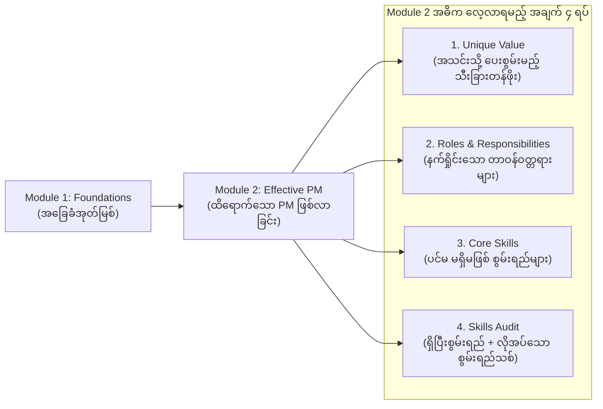

# Lesson 2.1: Introduction: Becoming an Effective Project Manager
*(Module 2 မိတ်ဆက်: ထိရောက်ထက်မြက်သော Project Manager တစ်ဦး ဖြစ်လာစေခြင်း)*

- **Course:** Google Project Management Certificate - Course 1: Foundations of Project Management
- **Module:** Module 2 - Becoming an effective project manager
- **Speaker:** Emilio (Program Manager at Google)
- **Topic:** Review of Module 1, Module 2 Core Objectives, Unique Value, Core Skills, and Skillset Gap Identification

---

## 📌 ၁။ အနှစ်ချုပ် မှတ်စု (Quick Summary & Key Takeaways)

::: tip 💡 မျက်စိထဲ တစ်ချက်ကြည့်ရုံဖြင့် မှတ်သားနိုင်သော အနှစ်ချုပ်
- **Module 1 ပြန်လည်သုံးသပ်ချက် (Recap):** 
  - PM အလုပ်အကိုင်လမ်းကြောင်းနှင့် Certificate မှတစ်ဆင့် အသက်မွေးဝမ်းကျောင်း ရည်မှန်းချက်များ အဆင့်မြှင့်တင်ပုံ။
  - ပရောဂျက်၏ အခြေခံ သဘောတရားများနှင့် အစိတ်အပိုင်းများ (Define a project and its components)။
  - ပရောဂျက် မန်နေဂျာ ရာထူး အမျိုးမျိုးနှင့် လုပ်ငန်းခွင် တာဝန်ယူမှုများ။
- **Module 2 ၏ အဓိက ရည်မှန်းချက် ၄ ရပ် (4 Core Learning Objectives):**
  1. **Unique Value:** PM တစ်ဦးသည် မိမိ၏ အဖွဲ့အစည်းနှင့် လုပ်ဖော်ကိုင်ဖက်များထံ မည်သို့သော ထူးခြားသည့် သီးသန့်တန်ဖိုး ဖြည့်ဆည်းပေးနိုင်သည်ကို ရှင်းပြနိုင်ခြင်း။
  2. **Roles & Responsibilities:** PM တစ်ဦး၏ နေ့စဉ်တာဝန်များနှင့် ဦးဆောင်မှု အခန်းကဏ္ဍများကို ပိုမိုနက်ရှိုင်းစွာ ဖော်ပြနိုင်ခြင်း။
  3. **Core Skills:** ထိရောက်သော PM တစ်ဦးတွင် ရှိရမည့် ပင်မ ကျွမ်းကျင်မှု အရည်အချင်းများကို အသေးစိတ် သတ်မှတ်ဖော်ပြနိုင်ခြင်း။
  4. **Skillset Recognition & Gap Analysis:** သင်ကိုယ်တိုင်၌ ယခင်ကတည်းက ရှိနှင့်ပြီးဖြစ်သော စွမ်းရည်များကို အသိအမှတ်ပြု သတ်မှတ်ပြီး၊ အလုပ်သစ်အတွက် ထပ်မံဖြည့်ဆည်းရမည့် စွမ်းရည်သစ်များကို စိစစ်ဖော်ထုတ် သင်ယူနိုင်ခြင်း။
:::

---

## 📖 ၂။ အပြည့်အစုံ ဘာသာပြန်နှင့် ရှင်းလင်းချက် (Bilingual Study Cards)

  

    📌 အပိုင်း (၁): Module 1 ပြန်လည်သုံးသပ်ခြင်းနှင့် PM အခန်းကဏ္ဍကို ပိုမိုနက်ရှိုင်းစွာ လေ့လာခြင်း (Review & Transition)
  

  

    

      
🇬🇧 Original English

      
Welcome back. Let's start by reviewing what we've discussed so far. Earlier, you were introduced to project management as a career path. We discussed how this course can help you advance your career goals with a project management certification. We also discussed some of the basics of project management, like how to define a project and its different components. Then, we went over some distinct project management careers, roles, and responsibilities. Now it's time to gain a deeper understanding of a project manager's role.

    

    

      
🇲🇲 မြန်မာပြန်နှင့် ရှင်းလင်းချက်

      
ကြိုဆိုပါတယ်ခင်ဗျာ။ ယခုအချိန်အထိ ကျွန်ုပ်တို့ ဆွေးနွေးခဲ့သည်များကို ပြန်လည်သုံးသပ်ခြင်းဖြင့် စတင်လိုက်ကြရအောင်။ ယခင် Module 1 တွင် သင့်အား Project Management အား အသက်မွေးဝမ်းကျောင်း အလုပ်အကိုင် လမ်းကြောင်းတစ်ခုအဖြစ် စတင် မိတ်ဆက်ပေးခဲ့ပါသည်။

      
ဤသင်ရိုးညွှန်းတမ်းသည် PM Professional Certificate အသိအမှတ်ပြုလက်မှတ်ဖြင့် သင့်အလုပ်အကိုင် ရည်မှန်းချက်များကို မည်သို့ တိုးတက်မြင့်မားစေနိုင်ကြောင်း ဆွေးနွေးခဲ့ကြသည်။ ထို့အပြင် ပရောဂျက်တစ်ခုကို မည်သို့ အဓိပ္ပာယ်ဖွင့်ဆိုသနည်းနှင့် ၎င်း၏ အစိတ်အပိုင်း အမျိုးမျိုး အပါအဝင် Project Management ၏ အခြေခံ သဘောတရားများကို လေ့လာခဲ့ပြီး ဖြစ်သည်။

      
ထို့နောက် မတူညီသော PM အလုပ်အကိုင်များ၊ ရာထူးအခန်းကဏ္ဍများနှင့် တာဝန်ဝတ္တရားများကို ခြုံငုံလေ့လာခဲ့ပြီးနောက် ယခုအခါတွင်မူ <strong>Project Manager တစ်ဦး၏ အခန်းကဏ္ဍကို ပိုမိုနက်နက်ရှိုင်းရှိုင်း နားလည်သဘောပေါက်ရန်</strong> အချိန်ရောက်ရှိလာပြီ ဖြစ်ပါသည်။

    

  

  

    📌 အပိုင်း (၂): Module 2 ၏ အဓိက ရလဒ်များ၊ ပင်မစွမ်းရည်များနှင့် စွမ်းရည်လိုအပ်ချက် စိစစ်ခြင်း (Core Outcomes & Skills Audit)
  

  

    

      
🇬🇧 Original English

      
By the end of this module, you'll be able to explain the unique value a project manager brings to their team. You'll also be able to describe a project manager's roles and responsibilities, and list their core skills.

      
This course will help you continue to recognize the skills that you already have that will help you become a successful project manager. It will also help you identify new skills that you may need to learn in preparation for your new career. Ready? Let's get started.

    

    

      
🇲🇲 မြန်မာပြန်နှင့် ရှင်းလင်းချက်

      
ဤ Module 2 အပြီးတွင် သင့်အနေဖြင့် Project Manager တစ်ဦးက မိမိ၏ အဖွဲ့သို့ ဖြည့်ဆည်းပေးနိုင်သော <strong>သီးခြားတန်ဖိုး (Unique Value)</strong> ကို ရှင်းပြနိုင်မည် ဖြစ်ပါသည်။ ထို့အပြင် PM တစ်ဦး၏ အခန်းကဏ္ဍ၊ တာဝန်ဝတ္တရားများနှင့် မရှိမဖြစ် <strong>ပင်မ ကျွမ်းကျင်မှု အရည်အချင်းများ (Core Skills)</strong> ကို စာရင်းပြုစု ဖော်ပြနိုင်မည် ဖြစ်ပါသည်။

      
ဤသင်ရိုးသည် အောင်မြင်သော PM တစ်ဦးဖြစ်လာစေရန် သင့်ထံတွင် <strong>ရှိနှင့်ပြီးဖြစ်သော စွမ်းရည်များ (Existing Skills)</strong> ကို ဆက်လက် အသိအမှတ်ပြု သတိထားမိစေရန် ကူညီပေးပါလိမ့်မည်။ ထို့အတူ မိမိ၏ အလုပ်အကိုင်သစ်အတွက် ကြိုတင်ပြင်ဆင်မှုအဖြစ် <strong>ထပ်မံလေ့လာဆည်းပူးရမည့် စွမ်းရည်သစ်များ (New Skills / Skills Gap)</strong> ကိုပါ ရှာဖွေဖော်ထုတ်နိုင်ရန် ကူညီပေးသွားမည် ဖြစ်ပါသည်။

      
အဆင်သင့်ဖြစ်ပြီလား? စတင်လိုက်ကြစို့။

    

  

---

## 📊 ၃။ Module 2 လေ့လာမှု လမ်းပြမြေပုံနှင့် အဓိက မှတ်တိုင် ၄ ခု (Learning Roadmap)

Module 2 သည် သီအိုရီ အခြေခံအဆင့် (Module 1) မှသည် **လက်တွေ့ ထိရောက်ထက်မြက်သော Project Manager (Effective PM)** တစ်ဦး ဖြစ်လာစေရန် ကူးပြောင်းပေးသည့် အဆင့်ဖြစ်ပါသည်။

### 📋 Module 2 ၏ ရလဒ် ၄ ခု ခွဲခြမ်းစိတ်ဖြာချက် (Key Breakdown)

| အဓိက ကဏ္ဍ (Domain) | အင်္ဂလိပ် အသုံးအနှုန်း | လက်တွေ့ သဘောတရားနှင့် အရေးပါပုံ |
|---|---|---|
| **၁။ သီးခြားတန်ဖိုး** | **Unique Value** | ပရောဂျက်တစ်ခု လမ်းချော်မသွားဘဲ ဘတ်ဂျက်နှင့် အချိန်မီပြီးစီးအောင် ထိန်းကျောင်းပေးပြီး အဖွဲ့သားအားလုံး တစ်သားတည်း ပူးပေါင်းနိုင်စေသည့် PM ၏ အစားထိုးမရသော တန်ဖိုး။ |
| **၂။ အခန်းကဏ္ဍနှင့် တာဝန်များ** | **Roles & Responsibilities** | ပြဿနာဖြေရှင်းခြင်း၊ ဆက်သွယ်ညှိနှိုင်းခြင်း၊ ဘတ်ဂျက်စီမံခြင်းနှင့် Deliverables များကို အာမခံချက်ရှိစွာ ပို့ဆောင်ပေးရသည့် တာဝန်များ။ |
| **၃။ ပင်မ ကျွမ်းကျင်မှုများ** | **Core Skills** | စီစဉ်ညှိနှိုင်းမှု (Organization)၊ ဆက်ဆံရေး (Communication)၊ ပြဿနာဖြေရှင်းမှု (Problem-solving) နှင့် စိတ်ရှည်ခေါင်းဆောင်မှု (Leadership)။ |
| **၄။ စွမ်းရည်စိစစ်သုံးသပ်ခြင်း** | **Skills Gap Analysis** | မိမိ၏ ယခင်အလုပ်/ဘဝအတွေ့အကြုံမှ ရရှိထားသော စွမ်းရည်များကို အခြေပြုပြီး၊ နယ်ပယ်သစ်အတွက် လိုအပ်မည့် အသိပညာအသစ်များကို ဖြည့်ဆည်းခြင်း။ |

---

## 📜 ၄။ မူရင်း စာသား အပြည့်အစုံ (Verbatim English Transcript)

::: details 📜 Original English Transcript (မူရင်းအင်္ဂလိပ်စာသား အပြည့်အစုံ)
Welcome back. Let's start by reviewing what we've discussed so far. Earlier, you were introduced to project management as a career path. We discussed how this course can help you advance your career goals with a project management certification. We also discussed some of the basics of project management, like how to define a project and its different components. Then, we went over some distinct project management careers, roles, and responsibilities. Now it's time to gain a deeper understanding of a project manager's role. 

By the end of this module, you'll be able to explain the unique value a project manager brings to their team. You'll also be able to describe a project manager's roles and responsibilities, and list their core skills. This course will help you continue to recognize the skills that you already have that will help you become a successful project manager. It will also help you identify new skills that you may need to learn in preparation for your new career. Ready? Let's get started.
:::

---

## 🔤 ၅။ အရေးကြီး ဝေါဟာရဘဏ် (Vocabulary Bank)

| စကားလုံး (Term) | အမျိုးအစား | အင်္ဂလိပ် အဓိပ္ပာယ်ဖွင့်ဆိုချက် | မြန်မာပြန်ဆိုချက် |
|---|---|---|---|
| **Effective Project Manager** | Noun Phrase | A project manager who successfully delivers project outcomes on time, within budget, and adds measurable value to the team and organization. | အသင်းနှင့် အဖွဲ့အစည်းအတွက် အချိန်မီ၊ ဘတ်ဂျက်တွင်းနှင့် တန်ဖိုးရှိသော ရလဒ်များ ဖန်တီးပေးနိုင်သည့် ထိရောက်ထက်မြက်သော PM။ |
| **Unique Value** | Noun Phrase | The distinct, irreplaceable positive impact and organizational benefit that a specific role provides. | အခြားသူများ အလွယ်တကူ အစားထိုး၍မရသော ပရောဂျက်မန်နေဂျာတစ်ဦးမှ အသင်းထံ ဖြည့်ဆည်းပေးသည့် သီးခြားတန်ဖိုး။ |
| **Core Skills** | Noun Phrase | The fundamental, essential competencies required to perform a job effectively. | လုပ်ငန်းတာဝန်တစ်ခုကို ထိရောက်စွာ ဆောင်ရွက်နိုင်ရန် မရှိမဖြစ် လိုအပ်သည့် ပင်မ ကျွမ်းကျင်မှု အရည်အချင်းများ။ |
| **Roles and Responsibilities** | Phrase | The specific functions, duties, and obligations expected of a professional in an organization. | အဖွဲ့အစည်းအတွင်း သက်ဆိုင်ရာ ရာထူးမှ ထမ်းဆောင်ရန် မျှော်လင့်ထားသော အခန်းကဏ္ဍများနှင့် တာဝန်ဝတ္တရားများ။ |
| **Skills Gap** | Noun Phrase | The difference between the skills a person currently possesses and the skills required for a target job. | မိမိလက်ရှိ တတ်မြောက်ထားသော စွမ်းရည်နှင့် လိုချင်သောအလုပ်အတွက် လိုအပ်နေသော စွမ်းရည်တို့အကြား ကွာဟချက်။ |
| **Advance your career goals** | Phrase | To make progress toward higher professional achievements, promotions, or successful job transitions. | မိမိ၏ အသက်မွေးဝမ်းကျောင်း လုပ်ငန်းခွင် ရည်မှန်းချက်များကို အဆင့်ဆင့် တိုးတက်အောင်မြင်စေသည်။ |

---

## ❓ ၆။ အသိစမ်းစစ်ချက် မေးခွန်းများ (Self-Review Knowledge Check)

### မေးခွန်း (၁): Module 2 တွင် အဓိကထား သင်ကြားပေးမည့် ရည်မှန်းချက်မဟုတ်သည့် အချက်မှာ အဘယ်နည်း။
- (က) ပရောဂျက် မန်နေဂျာတစ်ဦးက အဖွဲ့ထံ ယူဆောင်ပေးသော သီးခြားတန်ဖိုး (Unique Value) ကို ရှင်းပြနိုင်ခြင်း
- (ခ) ပရောဂျက် မန်နေဂျာတစ်ဦး၏ အခန်းကဏ္ဍ၊ တာဝန်များနှင့် ပင်မစွမ်းရည် (Core Skills) များကို စာရင်းပြုစုနိုင်ခြင်း
- (ဂ) ကုဒ်ရေးသားသည့် programming language များကို ကျွမ်းကျင်စွာ ရေးတတ်စေရန် လေ့ကျင့်ပေးခြင်း
- (ဃ) မိမိထံတွင် ရှိပြီးသား စွမ်းရည်များနှင့် အလုပ်သစ်အတွက် ထပ်မံဖြည့်ဆည်းရမည့် စွမ်းရည်သစ်များကို စိစစ်ဖော်ထုတ်ခြင်း

::: details 💡 အဖြေမှန်နှင့် ရှင်းလင်းချက်ကို ကြည့်ရန်
**အဖြေမှန်:** **(ဂ)**  
**ရှင်းလင်းချက်:** Module 2 ၏ အဓိက ရည်မှန်းချက်မှာ PM တစ်ဦး၏ အခန်းကဏ္ဍ၊ တာဝန်များ၊ သီးခြားတန်ဖိုးနှင့် ပင်မ စွမ်းရည်များ (စီမံခန့်ခွဲမှု၊ ဆက်ဆံရေး စသည်) ကို နားလည်စေရန် ဖြစ်ပါသည်။ ပရိုဂရမ်မင်း ကုဒ်ရေးသားခြင်း (Programming) သည် PM တစ်ဦးအတွက် မဖြစ်မနေ လိုအပ်ချက်မဟုတ်သလို၊ ဤ Module ၏ သင်ကြားမှု ရည်မှန်းချက်လည်း မဟုတ်ပါ။
:::

### မေးခွန်း (၂): သင်ခန်းစာအရ မိမိတွင် ရှိနှင့်ပြီးသော စွမ်းရည်များကို အသိအမှတ်ပြုခြင်းနှင့် အသစ်သင်ယူရမည့် စွမ်းရည်များကို ရှာဖွေခြင်း၏ အဓိက ရည်ရွယ်ချက်မှာ အဘယ်နည်း။
- (က) ပရောဂျက်တစ်ခုလုံးကို တစ်ဦးတည်း အစအဆုံး လုပ်ကိုင်နိုင်စေရန်
- (ခ) မိမိ၏ အလုပ်အကိုင်အသစ် (PM career) အတွက် စနစ်တကျ ကြိုတင်ပြင်ဆင်မှု ရှိစေရန်
- (ဂ) ယခင်လုပ်ဖူးသော အလုပ်အတွေ့အကြုံအားလုံးကို မေ့ပစ်လိုက်ရန်
- (ဃ) ကုမ္ပဏီအတွင်း အမြင့်ဆုံး ရာထူးတန်းကို ချက်ချင်း လျှောက်ထားရန်

::: details 💡 အဖြေမှန်နှင့် ရှင်းလင်းချက်ကို ကြည့်ရန်
**အဖြေမှန်:** **(ခ)**  
**ရှင်းလင်းချက်:** သင်တန်းသားများသည် ယခင်ဘဝ သို့မဟုတ် အလုပ်ဟောင်းများမှ ရရှိထားသည့် Transferable Skills များကို အသိအမှတ်ပြုပြီး၊ PM လောကအတွက် လိုအပ်နေသေးသော စွမ်းရည်သစ်များ (Skill gaps) ကို ဖြည့်ဆည်းသင်ယူခြင်းဖြင့် မိမိ၏ အသက်မွေးဝမ်းကျောင်း အသစ်အတွက် အကောင်းဆုံး ကြိုတင်ပြင်ဆင်နိုင်မည် ဖြစ်ပါသည်။
:::

