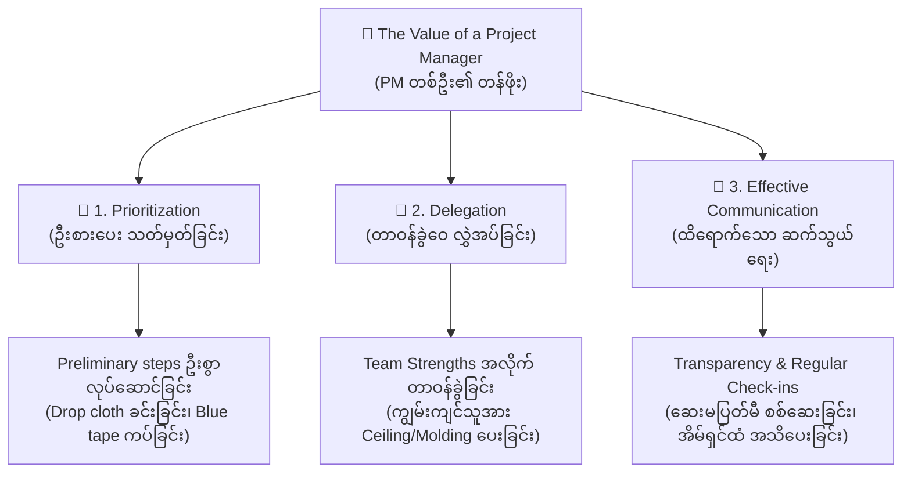

# Lesson 2.2: The Value of a Project Manager
*(Project Manager တစ်ဦး၏ တန်ဖိုးနှင့် အဖွဲ့အစည်းအပေါ် အကျိုးပြုပုံ)*

- **Course:** Google Project Management Certificate - Course 1: Foundations of Project Management
- **Module:** Module 2 - Becoming an effective project manager
- **Speaker:** Emilio (Program Manager at Google)
- **Topic:** Definition of a Project Manager, 3 Pillars of PM Value (Prioritization, Delegation, Effective Communication), House Painting Case Study

---

## 📌 ၁။ အနှစ်ချုပ် မှတ်စု (Quick Summary & Key Takeaways)

::: tip 💡 မျက်စိထဲ တစ်ချက်ကြည့်ရုံဖြင့် မှတ်သားနိုင်သော အနှစ်ချုပ်
- **Project Manager ၏ အဓိပ္ပာယ်ဖွင့်ဆိုချက် (Definition):**
  - PM များသည် ပရောဂျက်တစ်ခုကို အစမှ အဆုံးတိုင် ချောမောအောင်မြင်အောင် **ဦးဆောင်ထိန်းကျောင်းပေးသူ (Shepherd)** ဖြစ်ပြီး၊ မိမိအသင်းသားများအတွက် လမ်းညွှန်ပြသသူ (Guide) အဖြစ် တာဝန်ယူသည်။
  - အဖွဲ့သားများနှင့် လုပ်ငန်းခွင်အဆင်ပြေစေရန် အပြစ်ဆိုဖွယ်မရှိသော **စီစဉ်ညှိနှိုင်းမှုစွမ်းရည် (Organizational skills)** နှင့် **လူမှုဆက်ဆံရေးစွမ်းရည် (Interpersonal skills)** တို့ကို ခြေလှမ်းတိုင်းတွင် အသုံးချသည်။
- **PM တစ်ဦးက အဖွဲ့နှင့် ကုမ္ပဏီထံ တန်ဖိုးဖြည့်ဆည်းပေးသည့် အဓိက နည်းလမ်း ၃ သွယ် (3 Key Pillars of PM Value):**
  1. **Prioritization (ဦးစားပေးအဆင့် သတ်မှတ်ခြင်း):** ကြီးမားရှုပ်ထွေးသော အလုပ်များကို သေးငယ်သော အဆင့်များအဖြစ် ခွဲခြမ်းပေးခြင်း။ မည်သည့်အလုပ်ကို အရင်လုပ်ရမည် မသေချာပါက အဖွဲ့သားများနှင့် Stakeholders များထံမှ အချက်အလက်ရယူပြီး အစီအစဉ်ချမှတ်ခြင်း။ (ဥပမာ- ဆေးမသုတ်မီ ကြမ်းခင်းအကာခင်းခြင်း၊ အနားသတ်တိပ်ကပ်ခြင်း စသည့် အရေးကြီး Preliminary steps များကို ဦးစားပေး လုပ်ဆောင်စေခြင်း)။
  2. **Delegation (တာဝန်ခွဲဝေ လွှဲအပ်ခြင်း):** အလုပ်တာဝန်တစ်ခုချင်းစီကို အကိုက်ညီဆုံးနှင့် အကောင်းဆုံး လုပ်ဆောင်နိုင်မည့် လူများထံ ခွဲဝေပေးခြင်း (ဥပမာ- ဆေးသုတ်ကျွမ်းကျင်သူကို ခက်ခဲသော မျက်နှာကျက်နှင့် သစ်သားကွပ်များ သုတ်စေခြင်း) နှင့် အဆင့်ဆင့် ဆောင်ရွက်ရမည့် အလုပ်စဉ်များ (Order of tasks) ကို မှန်ကန်စွာ စီစဉ်ပေးခြင်း။
  3. **Effective Communication (ထိရောက်သော ဆက်သွယ်ရေးနှင့် ပွင့်လင်းမြင်သာမှု):**
     - **Internal Team:** အသင်းသားများနှင့် ပုံမှန် check-in လုပ်ခြင်း (ဆေးကုန်မလား ကြိုတင်စစ်ဆေး၍ ပရောဂျက် မရပ်တန့်အောင် ထိန်းသိမ်းခြင်း)။
     - **External Stakeholders:** လုပ်ငန်းဆောင်ရွက်မှုနှင့် ပတ်သက်ဆက်နွှယ်နေသော ပြင်ပလူများ (ဥပမာ- အိမ်ရှင်ထံ ကြိုတင်ခွင့်ပြုချက်တောင်းခြင်း၊ ရက်စွဲများ အသိပေးခြင်း) ဖြင့် အထင်အမြင်လွဲမှားခြင်းနှင့် မမျှော်လင့်ဘဲ အခက်ကြုံရခြင်း (Caught off guard) မှ ကာကွယ်ပေးခြင်း။
- **အကယ်၍ PM မရှိခဲ့ပါက:** ဆေးမသုတ်မီ အောက်ခံမခင်းသဖြင့် ကြမ်းခင်းများ ပျက်စီးခြင်း၊ ဆေးသုတ်နေရင်း ဆေးပြတ်သွားခြင်း၊ အိမ်ရှင်က မသိရှိဘဲ ဒေါသထွက်ခြင်းတို့ ဖြစ်ပေါ်နိုင်သည်။ PM ရှိခြင်းကြောင့်သာ ပရောဂျက်တစ်ခုလုံး ချောမွေ့ပြီး ထိရောက်စွာ အောင်မြင်နိုင်ခြင်း ဖြစ်သည်။
:::

---

## 📖 ၂။ အပြည့်အစုံ ဘာသာပြန်နှင့် ရှင်းလင်းချက် (Bilingual Study Cards)

  

    📌 အပိုင်း (၁): PM ၏ အဓိပ္ပာယ်ဖွင့်ဆိုချက်နှင့် အဖွဲ့ကို ဦးဆောင်ထိန်းကျောင်းခြင်း (Definition & Shepherding)
  

  

    

      
🇬🇧 Original English

      
Earlier in this course, we introduced you to the world of project management. We discussed how project management spans industries and companies of all kinds, from large corporations to small businesses. Now let's define what a project manager is and describe how they add value to their teams and organizations.

      
Let's start with the definition. Project managers shepherd projects from start to finish and serve as guides for their team, using their impeccable organizational and interpersonal skills every step of the way.

      
As you learned earlier, project managers usually follow a process that involves planning and organizing, managing tasks, budgeting, and controlling costs so that the project can be completed within the approved timeframe. We'll dig deeper into these topics throughout this program.

    

    

      
🇲🇲 မြန်မာပြန်နှင့် ရှင်းလင်းချက်

      
ဤသင်ရိုး၏ အစောပိုင်းတွင် ကျွန်ုပ်တို့သည် သင့်အား Project Management လောကနှင့် မိတ်ဆက်ပေးခဲ့ပြီး ဖြစ်ပါသည်။ Project Management သည် ကော်ပိုရေးရှင်းကြီးများမှသည် အသေးစား စီးပွားရေးလုပ်ငန်းများအထိ ကဏ္ဍစုံနှင့် ကုမ္ပဏီအမျိုးအစားပေါင်းစုံတွင် ကျယ်ပြန့်စွာ အသုံးဝင်ပုံကိုလည်း ဆွေးနွေးခဲ့ကြသည်။ ယခုအခါတွင်မူ Project Manager ဆိုတာ ဘာလဲဆိုသည့် အဓိပ္ပာယ်ဖွင့်ဆိုချက်နှင့် ၎င်းတို့သည် မိမိတို့၏ အဖွဲ့အစည်းနှင့် လုပ်ဖော်ကိုင်ဖက်များထံ <strong>တန်ဖိုး (Value) မည်သို့ ဖြည့်ဆည်းပေးသနည်း</strong> ဆိုသည်ကို လေ့လာကြပါမည်။

      
အဓိပ္ပာယ်ဖွင့်ဆိုချက်ဖြင့် စတင်လိုက်ကြရအောင်။ <strong>Project Manager များဆိုသည်မှာ ပရောဂျက်များကို အစမှ အဆုံးတိုင် စောင့်ရှောက်ထိန်းကျောင်းပေးသူ (Shepherd) များဖြစ်ကြပြီး</strong>၊ ခြေလှမ်းတိုင်းတွင် အပြစ်ဆိုဖွယ်မရှိသော စီစဉ်ညှိနှိုင်းမှု စွမ်းရည်များနှင့် လူမှုဆက်ဆံရေး စွမ်းရည်များကို အသုံးချကာ မိမိတို့၏ အဖွဲ့အတွက် လမ်းပြအဖြစ် ဆောင်ရွက်သူများ ဖြစ်ကြပါသည်။

      
ယခင်က သင်ယူခဲ့သည့်အတိုင်း Project Manager များသည် ပရောဂျက်တစ်ခုကို ခွင့်ပြုထားသော အချိန်ကာလ (Approved timeframe) အတွင်း ပြီးမြောက်စေရန်အတွက် စီစဉ်စုစည်းခြင်း၊ တာဝန်များ စီမံခန့်ခွဲခြင်း၊ ဘတ်ဂျက်တွက်ချက်ခြင်းနှင့် ကုန်ကျစရိတ် ထိန်းချုပ်ခြင်းတို့ ပါဝင်သည့် စနစ်ကျသော လုပ်ငန်းစဉ်ကို လိုက်နာဆောင်ရွက်ကြပါသည်။ ဤအစီအစဉ်တစ်လျှောက်လုံးတွင် ဤအကြောင်းအရာများကို ပိုမိုနက်နက်ရှိုင်းရှိုင်း လေ့လာသွားကြပါမည်။

    

  

  

    📌 အပိုင်း (၂): တန်ဖိုးဖြည့်ဆည်းမှု နည်းလမ်း (၁) - ဦးစားပေးအဆင့် သတ်မှတ်ခြင်း (Prioritization & House Painting Example)
  

  

    

      
🇬🇧 Original English

      
What you need to know right now is that project managers play a crucial role in their organizations. Project managers add value to their teams and organizations in key ways that include prioritization, delegation, and effective communication. So let's break these down.

      
First, we'll discuss prioritization. Project managers add value to their teams and organizations through effective prioritization of tasks required to complete a project. They're experts at helping team members identify and break down large tasks into smaller steps. There'll be times when a project manager may not know which task to prioritize. To determine which ones are the most critical to the success of the project, they'll connect with their teams and with stakeholders to gather information and make a plan.

      
Stakeholders are people who are interested in and affected by the project's completion and success, like the leader of an organization. You've probably used prioritization to complete work in the past. In any kind of project, personal or professional, there are tasks with different levels of priority.

      
For example, let's imagine that you've decided to rent a house and plan to repaint the rooms. You've picked out your paint and you're eager to get started. While it may be tempting to start painting right away, you'll need to prioritize tasks like laying out drop cloths to protect the floors and furniture, applying blue tape to the rooms' edges, and much more.

      
Those preliminary steps are critical and need to come before painting. Other related steps, like choosing new face plates for your light switches, can come later in the process or be switched out of the project entirely if you run out of time or money. When you choose to take care of these preliminary steps before wedging open the paint can, you're prioritizing the tasks or steps of your project. You're also increasing the likelihood that you'll be satisfied with your newly-painted rooms. This process is similar for professional projects. When you effectively prioritize important tasks, you set up your team and yourself for a better project outcome.

    

    

      
🇲🇲 မြန်မာပြန်နှင့် ရှင်းလင်းချက်

      
ယခုအချိန်တွင် သင်သိရှိထားရမည့် အချက်မှာ Project Manager များသည် ကုမ္ပဏီအဖွဲ့အစည်းများတွင် အလွန်အရေးပါသော အခန်းကဏ္ဍမှ ပါဝင်နေသည်ဟူသော အချက်ပင် ဖြစ်သည်။ PM များသည် အဓိကနည်းလမ်း ၃ သွယ်ဖြစ်သော <strong>ဦးစားပေး သတ်မှတ်ခြင်း (Prioritization)</strong>၊ <strong>တာဝန်ခွဲဝေ လွှဲအပ်ခြင်း (Delegation)</strong> နှင့် <strong>ထိရောက်သော ဆက်သွယ်ရေး (Effective Communication)</strong> တို့မှတစ်ဆင့် တန်ဖိုးဖန်တီး ပေးဆပ်ကြပါသည်။

      
ပထမဦးစွာ <strong>Prioritization</strong> အကြောင်း ဆွေးနွေးပါမည်။ PM များသည် ပရောဂျက်ပြီးမြောက်ရန် လိုအပ်သည့် လုပ်ငန်းများကို ထိရောက်စွာ ဦးစားပေး သတ်မှတ်ပေးခြင်းဖြင့် တန်ဖိုးဖြည့်ဆည်းပေးသည်။ ၎င်းတို့သည် ကြီးမားသောအလုပ်ကြီးများကို သေးငယ်သော အဆင့်များအဖြစ် ခွဲခြမ်းရာတွင် ကျွမ်းကျင်သူများ ဖြစ်ကြသည်။ မည်သည့်အလုပ်ကို ဦးစားပေးရမည် မသေချာသည့် အခြေအနေမျိုးတွင် ပရောဂျက်အောင်မြင်ရေးအတွက် အရေးအကြီးဆုံးအရာများကို ဆုံးဖြတ်ရန် အဖွဲ့သားများနှင့် <strong>Stakeholders (အကျိုးတူ သက်ဆိုင်သူများ)</strong> ထံ ဆက်သွယ်၍ အချက်အလက်များ စုဆောင်းကာ အစီအစဉ် ရေးဆွဲကြသည်။

      
<strong>လက်တွေ့ အိမ်ဆေးသုတ် ပရောဂျက် ဥပမာ-</strong> သင်သည် အိမ်ငှားတစ်လုံးကို အခန်းများ ဆေးအသစ်ပြန်သုတ်ရန် စီစဉ်သည်ဆိုပါစို့။ ဆေးဘူးဖွင့်ပြီး ချက်ချင်း သုတ်ချင်စိတ် မည်မျှပင် ပြင်းပြစေကာမူ၊ ဆေးမသုတ်မီ ကြမ်းပြင်နှင့် ပရိဘောဂများ မပေကျံစေရန် <strong>အကာအကွယ် အခင်းပြားများ (Drop cloths) ကြိုခင်းခြင်း</strong>၊ အခန်းထောင့်စွန်းများကို အပြာရောင်တိပ် ကပ်ခြင်းစသည့် ကြိုတင်ပြင်ဆင်မှု <strong>(Preliminary steps)</strong> များကို ဦးစားပေး လုပ်ဆောင်ရမည် ဖြစ်သည်။

      
မီးခလုတ် အဖုံးအသစ်များ လဲလှယ်ခြင်းကဲ့သို့သော အဆင့်များသည် အချိန် သို့မဟုတ် ငွေကုန်သွားပါက နောက်မှလုပ်နိုင်သည် သို့မဟုတ် လုံးဝဖျက်သိမ်းနိုင်သည်။ ဆေးဘူး မဖွင့်မီ ဤအရေးကြီး ကြိုတင်အဆင့်များကို လုပ်ဆောင်ခြင်းသည် ဦးစားပေးသတ်မှတ်မှု (Prioritization) ပင် ဖြစ်ပြီး၊ ၎င်းက အလုပ်ပြီးချိန်တွင် စိတ်ကျေနပ်မှုကို များစွာ တိုးတက်စေပါသည်။ ပရော်ဖက်ရှင်နယ် ပရောဂျက်များတွင်လည်း ဤသဘောတရားအတိုင်းပင် အရေးကြီးသော အဆင့်များကို ဦးစားပေး သတ်မှတ်ခြင်းဖြင့် ပိုမိုကောင်းမွန်သော ရလဒ်ကို ရရှိစေပါသည်။

    

  

  

    📌 အပိုင်း (၃): တန်ဖိုးဖြည့်ဆည်းမှု နည်းလမ်း (၂) - တာဝန်ခွဲဝေ လွှဲအပ်ခြင်း (Delegation & Matching Strengths)
  

  

    

      
🇬🇧 Original English

      
Now, let's discuss delegation. Project managers use delegation to add value to their teams and organizations by matching tasks to individuals who can best complete the work.

      
Let's return to our house painting example for a second here. Painting multiple rooms can be a time-consuming project, so it's possible that you might enlist a few friends to help you get it done. Maybe one friend has professional painting experience. Now, with that in mind, you might ask her to handle the more challenging aspects of the project, like painting the ceiling or the detailed molding.

      
You might also schedule her to paint the molding before another friend paints the walls. So by delegating this task to the person with the right skills to complete the work and ordering the task appropriately, you're applying knowledge of your team's strengths to the planning of your project. That makes sense, right?

    

    

      
🇲🇲 မြန်မာပြန်နှင့် ရှင်းလင်းချက်

      
ယခုအခါ <strong>တာဝန်ခွဲဝေ လွှဲအပ်ခြင်း (Delegation)</strong> အကြောင်း ဆွေးနွေးပါမည်။ Project Manager များသည် လုပ်ငန်းတာဝန်များကို အကောင်းဆုံး ပြီးမြောက်အောင် ဆောင်ရွက်နိုင်မည့် သင့်တော်သော လူပုဂ္ဂိုလ်များနှင့် <strong>ကိုက်ညီအောင် တွဲဖက်ပေးခြင်း (Matching tasks to individuals)</strong> ဖြင့် တန်ဖိုး ဖြည့်ဆည်းပေးကြသည်။

      
အိမ်ဆေးသုတ်သည့် ဥပမာသို့ ပြန်သွားကြည့်ကြစို့။ အခန်းများစွာ ဆေးသုတ်ခြင်းသည် အချိန်ကုန်သော အလုပ်ဖြစ်သဖြင့် မိတ်ဆွေသူငယ်ချင်း အချို့ကို အကူအညီတောင်းရပေမည်။ သူငယ်ချင်းတစ်ဦးတွင် ပရော်ဖက်ရှင်နယ် ဆေးသုတ်ဖူးသည့် အတွေ့အကြုံရှိသည် ဆိုပါစို့။ ထိုအခါ သူမအား မျက်နှာကျက် သုတ်ခြင်း သို့မဟုတ် အနုစိတ် သစ်သားကွပ်များ <strong>(Detailed molding)</strong> ကို သုတ်ခြင်းကဲ့သို့သော ခက်ခဲသည့် တာဝန်များကို လွှဲအပ်ပေးရပေမည်။

      
ထို့အပြင် အခြားသူငယ်ချင်းတစ်ဦး နံရံမသုတ်မီ၊ ထိုကျွမ်းကျင်သူငယ်ချင်းအား သစ်သားကွပ်များကို အရင်သုတ်ရန် အချိန်ဇယား ရေးဆွဲပေးနိုင်သည်။ ဤသို့ဖြင့် လုပ်ငန်းကို အောင်မြင်စွာ ပြီးမြောက်စေနိုင်သည့် မှန်ကန်သော ကျွမ်းကျင်မှုရှိသူထံ တာဝန်လွှဲအပ်ခြင်းနှင့် လုပ်ငန်းစဉ်ကို စနစ်တကျ အစီအစဉ်ချမှတ်ခြင်းအားဖြင့် သင်သည် <strong>မိမိအဖွဲ့၏ အားသာချက်များကို ပရောဂျက်စီမံမှုတွင် လက်တွေ့အသုံးချနေခြင်း</strong> ဖြစ်ပါသည်။ အလွန် အဓိပ္ပာယ်ရှိသော ဆောင်ရွက်မှု မဟုတ်ပါလား?

    

  

  

    📌 အပိုင်း (၄): တန်ဖိုးဖြည့်ဆည်းမှု နည်းလမ်း (၃) - ထိရောက်သော ဆက်သွယ်ရေးနှင့် ပွင့်လင်းမြင်သာမှု (Communication & Transparency)
  

  

    

      
🇬🇧 Original English

      
Finally, let's talk about effective communication. Project managers deliver value through effective communication, both with their team and with key stakeholders. This refers to being transparent, which means being up front with plans and ideas and making information readily available.

      
Project managers keep in regular contact with their team about the progress of the work and help identify areas where a teammate may need support. In our house painting example, this might involve checking in with your friends periodically to ask if they have enough paint or supplies left to complete their tasks. Checking in regularly means you'll know if you need to buy more paint before the can is empty, which ensures that the project stays on track.

      
In addition to keeping up with teammates, project managers keep in regular contact with people outside of the team, like company leaders who are invested in the project outcomes. For example, you might reach out to your landlord to get permission to paint and to share the days you'll be working on this project. Though your landlord isn't directly involved in the project's execution, the outcomes will affect her property and so it's important to keep her informed.

    

    

      
🇲🇲 မြန်မာပြန်နှင့် ရှင်းလင်းချက်

      
နောက်ဆုံးအနေဖြင့် <strong>ထိရောက်သော ဆက်သွယ်ရေး (Effective Communication)</strong> ဖြစ်ပါသည်။ PM များသည် မိမိအသင်းသားများနှင့်ရော အဓိက Stakeholders များနှင့်ပါ ထိရောက်သော ဆက်သွယ်ပြောဆိုမှုများ ပြုလုပ်ခြင်းဖြင့် တန်ဖိုးကို ပေးအပ်ကြသည်။ ၎င်းတွင် <strong>ပွင့်လင်းမြင်သာမှုရှိခြင်း (Being transparent)</strong> ပါဝင်ပြီး၊ အစီအစဉ်များနှင့် စိတ်ကူးများကို ရှေ့တန်းတင် ရှင်းလင်းစွာ ပြောဆိုခြင်းနှင့် လိုအပ်သော အချက်အလက်များကို အလွယ်တကူ ရယူနိုင်အောင် ဖန်တီးပေးခြင်းဟု အဓိပ္ပာယ်ရပါသည်။

      
PM များသည် လုပ်ငန်းတိုးတက်မှု အခြေအနေများကို အသင်းသားများနှင့် ပုံမှန် အဆက်အသွယ်မပြတ် စစ်ဆေးမေးမြန်းပြီး၊ မည်သည့် အဖွဲ့သားက အကူအညီလိုအပ်နေသနည်းဆိုသည်ကို ဖော်ထုတ်ပေးသည်။ ဆေးသုတ်သည့် ဥပမာအရ သူငယ်ချင်းများထံ အခါအားလျော်စွာ စစ်ဆေးမေးမြန်းပြီး ဆေး သို့မဟုတ် ပစ္စည်းများ လုံလောက်မှု ရှိမရှိ စစ်ဆေးခြင်း ဖြစ်သည်။ ပုံမှန်စစ်ဆေးခြင်းဖြင့် <strong>ဆေးဗူး လုံးဝမပြတ်မီ ဆေးထပ်ဝယ်ရန် လိုအပ်သည်ကို ကြိုတင်သိရှိနိုင်ပြီး</strong> ပရောဂျက် အချိန်မဆွဲဘဲ လမ်းကြောင်းမှန်ပေါ်တွင် ရှိနေစေပါသည်။

      
လုပ်ဖော်ကိုင်ဖက်များနှင့် အဆက်အသွယ်ပြုလုပ်ရုံသာမက PM များသည် ပရောဂျက်ရလဒ်နှင့် ပတ်သက်နေသော ကုမ္ပဏီခေါင်းဆောင်များကဲ့သို့ <strong>အဖွဲ့ပြင်ပ လူပုဂ္ဂိုလ်များနှင့်လည်း ပုံမှန် အဆက်အသွယ် ရှိနေရပါသည်</strong>။ ဥပမာ- ဆေးသုတ်ရန် အိမ်ရှင်ထံမှ ကြိုတင်ခွင့်ပြုချက် ရယူခြင်းနှင့် အလုပ်လုပ်မည့် နေ့ရက်များကို အသိပေးခြင်းမျိုး ဖြစ်သည်။ အိမ်ရှင်သည် ဆေးသုတ်ရာတွင် ကိုယ်တိုင်မပါဝင်သော်လည်း၊ ပရောဂျက်ရလဒ်က သူမ၏ အိမ်ခြံမြေအပေါ် တိုက်ရိုက် သက်ရောက်မှုရှိသောကြောင့် သူမကို အမြဲအသိပေးထားရန် (Keep her informed) အရေးကြီးပါသည်။

    

  

  

    📌 အပိုင်း (၅): PM မရှိခြင်း vs. PM ရှိခြင်း လက်တွေ့ အကျိုးရလဒ် (Impact & Summary)
  

  

    

      
🇬🇧 Original English

      
Without your project management skills, you might run out of paint halfway through the project, your walls might get painted without drop cloths to protect the floors, and your landlord could be caught off guard about your plans. So it's a good thing you're here to keep the project running smoothly and efficiently.

      
Great. Now you should be able to define what a project manager is and explain how they use prioritization, delegation, and effective communication to deliver value to their organizations. Coming up, you'll hear about the career path of a real life project manager at Google. Their journey to me is fascinating and we can't wait to share it with you.

    

    

      
🇲🇲 မြန်မာပြန်နှင့် ရှင်းလင်းချက်

      
သင့်ထံတွင် Project Management စွမ်းရည်များ မရှိခဲ့ပါက ပရောဂျက်တစ်ဝက်တွင် ဆေးပြတ်သွားခြင်း၊ ကြမ်းခင်းများကို ကာကွယ်သည့် အခင်းမပါဘဲ ဆေးပေကျံခြင်း၊ နှင့် အိမ်ရှင်က သင့်အစီအစဉ်ကို မသိရှိဘဲ <strong>မမျှော်လင့်ဘဲ အခက်ကြုံရခြင်း (Caught off guard)</strong> တို့ ဖြစ်ပေါ်နိုင်ပါသည်။ ထို့ကြောင့် ပရောဂျက်ကို ချောမွေ့ထိရောက်စွာ လည်ပတ်စေရန် သင်ကဲ့သို့သော PM တစ်ဦး ရှိနေခြင်းသည် အလွန်ကောင်းမွန်သော ကိစ္စဖြစ်ပါသည်။

      
အလွန်ကောင်းပါပြီ။ ယခုအခါတွင် သင်သည် Project Manager တစ်ဦး၏ အဓိပ္ပာယ်ဖွင့်ဆိုချက်နှင့် ၎င်းတို့သည် ဦးစားပေးသတ်မှတ်ခြင်း၊ တာဝန်ခွဲဝေခြင်းနှင့် ထိရောက်သော ဆက်သွယ်ရေးတို့ကို အသုံးပြု၍ အဖွဲ့အစည်းသို့ တန်ဖိုးမည်သို့ ဖြည့်ဆည်းပေးသည်ကို ရှင်းပြနိုင်ပြီ ဖြစ်ပါသည်။ နောက်လာမည့် ဗီဒီယိုတွင် Google ရှိ လက်တွေ့ PM တစ်ဦး၏ အသက်မွေးဝမ်းကျောင်း ခရီးလမ်းကို စိတ်လှုပ်ရှားဖွယ် နားဆင်ရမည် ဖြစ်ပါသည်။

    

  

---

## 📊 ၃။ လက်တွေ့ အိမ်ဆေးသုတ် Case Study နှင့် PM တန်ဖိုး ၃ ရပ် (3-Pillar Value Framework)

Project Manager တစ်ဦး၏ တန်ဖိုးသည် အောက်ပါ မဏ္ဍိုင်ကြီး ၃ ခုပေါ်တွင် အခိုင်အမာ တည်ဆောက်ထားပါသည်။

### 📋 PM မရှိခြင်း vs. PM ရှိခြင်း နှိုင်းယှဉ်ချက်ဇယား (Without PM vs. With PM)

| လုပ်ငန်းအဆင့် (Phase) | ❌ PM မရှိသော ပရောဂျက် (Chaos & Risks) | ✅ PM ရှိသော ပရောဂျက် (Controlled & Valuable) |
|---|---|---|
| **ကြိုတင်ပြင်ဆင်မှု (Preparation)** | ချက်ချင်း ဆေးသုတ်သဖြင့် ကြမ်းခင်းနှင့် ပရိဘောဂများ ဆေးပေကျံ ပျက်စီးခြင်း။ | **Drop cloths** ခင်းပြီး **Blue tape** ကပ်သည့် Preliminary steps များကို ဦးစားပေး လုပ်ဆောင်ခြင်း။ |
| **လုပ်ငန်းခွဲဝေမှု (Task Assignment)** | မည်သူက မည်သည့်အလုပ်လုပ်ရမည် မသိဘဲ လုပ်ငန်းများ ရှုပ်ထွေးနှောင့်နှေးခြင်း။ | ကျွမ်းကျင်သူအား **Molding & Ceiling** ပေးအပ်ပြီး အလုပ်စဉ်အတိုင်း စနစ်တကျ စီစဉ်ခြင်း (**Delegation**)。 |
| **ပစ္စည်းစီမံခန့်ခွဲမှု (Logistics/Budget)** | အလုပ်လုပ်နေရင်း ဆေးပြတ်သွားသဖြင့် လုပ်ငန်းခွင် တစ်ဝက်တစ်ပျက် ရပ်ဆိုင်းရခြင်း။ | အသင်းသားများနှင့် ပုံမှန် **Check-in** လုပ်ပြီး ဆေးဗူးမကုန်မီ ကြိုတင်ဝယ်ယူ ထိန်းကျောင်းခြင်း။ |
| **Stakeholder ဆက်ဆံရေး** | အိမ်ရှင်မသိဘဲ လုပ်သဖြင့် ရန်ဖြစ်ရခြင်း၊ စပေါ်ငွေ အဖြတ်ခံရနိုင်ခြင်း (**Caught off guard**)။ | အိမ်ရှင်ထံ ကြိုတင်ခွင့်ပြုချက်ယူပြီး လုပ်မည့်ရက်များကို ရှင်းလင်းစွာ အသိပေးထားခြင်း (**Transparent**)။ |

---

## 📜 ၄။ မူရင်း စာသား အပြည့်အစုံ (Verbatim English Transcript)

::: details 📜 Original English Transcript (မူရင်းအင်္ဂလိပ်စာသား အပြည့်အစုံ)
Earlier in this course, we introduced you to the world of project management. We discussed how project management spans industries and companies of all kinds, from large corporations to small businesses. Now let's define what a project manager is and describe how they add value to their teams and organizations. Let's start with the definition. Project managers shepherd projects from start to finish and serve as guides for their team, using their impeccable organizational and interpersonal skills every step of the way. As you learned earlier, project managers usually follow a process that involves planning and organizing, managing tasks, budgeting, and controlling costs so that the project can be completed within the approved timeframe. We'll dig deeper into these topics throughout this program. 

What you need to know right now is that project managers play a crucial role in their organizations. Project managers add value to their teams and organizations in key ways that include prioritization, delegation, and effective communication. So let's break these down. First, we'll discuss prioritization. Project managers add value to their teams and organizations through effective prioritization of tasks required to complete a project. They're experts at helping team members identify and break down large tasks into smaller steps. There'll be times when a project manager may not know which task to prioritize. 

To determine which ones are the most critical to the success of the project, they'll connect with their teams and with stakeholders to gather information and make a plan. Stakeholders are people who are interested in and affected by the project's completion and success, like the leader of an organization. You've probably used prioritization to complete work in the past. In any kind of project, personal or professional, there are tasks with different levels of priority. For example, let's imagine that you've decided to rent a house and plan to repaint the rooms. You've picked out your paint and you're eager to get started. While it may be tempting to start painting right away, you'll need to prioritize tasks like laying out drop cloths to protect the floors and furniture, applying blue tape to the rooms' edges, and much more. 

Those preliminary steps are critical and need to come before painting. Other related steps, like choosing new face plates for your light switches, can come later in the process or be switched out of the project entirely if you run out of time or money. When you choose to take care of these preliminary steps before wedging open the paint can, you're prioritizing the tasks or steps of your project. You're also increasing the likelihood that you'll be satisfied with your newly-painted rooms. This process is similar for professional projects. When you effectively prioritize important tasks, you set up your team and yourself for a better project outcome. Now, let's discuss delegation. 

Project managers use delegation to add value to their teams and organizations by matching tasks to individuals who can best complete the work. Let's return to our house painting example for a second here. Painting multiple rooms can be a time-consuming project, so it's possible that you might enlist a few friends to help you get it done. Maybe one friend has professional painting experience. Now, with that in mind, you might ask her to handle the more challenging aspects of the project, like painting the ceiling or the detailed molding. You might also schedule her to paint the molding before another friend paints the walls. So by delegating this task to the person with the right skills to complete the work and ordering the task appropriately, you're applying knowledge of your team's strengths to the planning of your project. 

That makes sense, right? Finally, let's talk about effective communication. Project managers deliver value through effective communication, both with their team and with key stakeholders. This refers to being transparent, which means being up front with plans and ideas and making information readily available. Project managers keep in regular contact with their team about the progress of the work and help identify areas where a teammate may need support. In our house painting example, this might involve checking in with your friends periodically to ask if they have enough paint or supplies left to complete their tasks. Checking in regularly means you'll know if you need to buy more paint before the can is empty, which ensures that the project stays on track. 

In addition to keeping up with teammates, project managers keep in regular contact with people outside of the team, like company leaders who are invested in the project outcomes. For example, you might reach out to your landlord to get permission to paint and to share the days you'll be working on this project. Though your landlord isn't directly involved in the project's execution, the outcomes will affect her property and so it's important to keep her informed. Without your project management skills, you might run out of paint halfway through the project, your walls might get painted without drop cloths to protect the floors, and your landlord could be caught off guard about your plans. So it's a good thing you're here to keep the project running smoothly and efficiently. Great. Now you should be able to define what a project manager is and explain how they use prioritization, delegation, and effective communication to deliver value to their organizations. 

Coming up, you'll hear about the career path of a real life project manager at Google. Their journey to me is fascinating and we can't wait to share it with you.
:::

---

## 🔤 ၅။ အရေးကြီး ဝေါဟာရဘဏ် (Vocabulary Bank)

| စကားလုံး (Term) | အမျိုးအစား | အင်္ဂလိပ် အဓိပ္ပာယ်ဖွင့်ဆိုချက် | မြန်မာပြန်ဆိုချက် |
|---|---|---|---|
| **Shepherd** | Verb | To guide, direct, protect, and tend to a project or team from inception to completion. | ပရောဂျက်တစ်ခုကို အစမှ အဆုံးတိုင် စနစ်တကျ ထိန်းကျောင်း စောင့်ရှောက် လမ်းပြပေးသည်။ |
| **Impeccable** | Adjective | Flawless, exemplary, in accordance with the highest standards; faultless. | ချွတ်ယွင်းချက်မရှိ အပြစ်ဆိုဖွယ်မရှိသော၊ စံနမူနာပြ ထူးချွန်သော။ |
| **Prioritization** | Noun | The process of arranging tasks or steps in order of their importance, urgency, or logical sequence. | လုပ်ငန်းတာဝန်များကို အရေးကြီးမှုနှင့် အရေးတကြီး လိုအပ်မှုအလိုက် ဦးစားပေးအဆင့် သတ်မှတ်ခြင်း။ |
| **Delegation** | Noun | The assignment of responsibility and authority to another person to carry out specific activities. | အလုပ်တာဝန်နှင့် လုပ်ပိုင်ခွင့်များကို အသင့်တော်ဆုံးသူထံ စနစ်တကျ ခွဲဝေလွှဲအပ်ခြင်း။ |
| **Transparency** | Noun | The practice of being open, honest, and accessible with project plans, data, decisions, and progress. | ပရောဂျက် အစီအစဉ်များနှင့် အချက်အလက်များကို ဖုံးကွယ်မထားဘဲ အားလုံးမြင်သာ ပွင့်လင်းစေခြင်း။ |
| **Drop Cloth** | Noun Phrase | A large sheet of fabric or plastic spread over floors and furniture to protect them from paint drips. | ဆေးသုတ်ရာတွင် ကြမ်းပြင်နှင့် ပရိဘောဂများ မပေကျံစေရန် အောက်တွင် ခင်းထားရသော အကာအကွယ် အခင်းပြား။ |
| **Preliminary Steps** | Noun Phrase | Preparatory, initial actions or prerequisites that must occur before the main work can begin. | ပင်မလုပ်ငန်း မစတင်မီ မဖြစ်မနေ ကြိုတင်လုပ်ဆောင်ထားရမည့် ပြင်ဆင်မှု အဆင့်များ။ |
| **Molding** | Noun | Decorative woodwork or plaster strips running along the walls, ceiling, or floors of a room. | အခန်းနံရံ၊ မျက်နှာကျက် သို့မဟုတ် ကြမ်းခင်းစွန်းများတွင် အလှတပ်ဆင်ထားသော သစ်သားကွပ်/အနားကွပ်များ။ |
| **Caught off guard** | Idiom | Surprised, unprepared, or taken unaware by an unexpected event or announcement. | မမျှော်လင့်ဘဲ အလစ်အငိုက် မိသွားသည်၊ ကြိုတင်မသိရှိဘဲ အခက်ကြုံရသည်။ |
| **Timeframe** | Noun | The agreed-upon period or duration within which a project or task must be executed. | ပရောဂျက် သို့မဟုတ် တာဝန်တစ်ခုကို ပြီးမြောက်အောင် ဆောင်ရွက်ရမည့် သတ်မှတ်ကာလဘောင်။ |

---

## ❓ ၆။ အသိစမ်းစစ်ချက် မေးခွန်းများ (Self-Review Knowledge Check)

### မေးခွန်း (၁): သင်ခန်းစာအရ Project Manager တစ်ဦးသည် မိမိ၏ အဖွဲ့အစည်းနှင့် လုပ်ငန်းခွင်သို့ တန်ဖိုး (Value) ဖြည့်ဆည်းပေးသည့် အဓိက နည်းလမ်း ၃ သွယ်မှာ အဘယ်နည်း။
- (က) Coding, Graphic Designing, and Accounting
- (ခ) Prioritization, Delegation, and Effective Communication
- (Kh) Marketing, Sales, and Customer Support
- (ဃ) Hiring, Firing, and Auditing

::: details 💡 အဖြေမှန်နှင့် ရှင်းလင်းချက်ကို ကြည့်ရန်
**အဖြေမှန်:** **(ခ)**  
**ရှင်းလင်းချက်:** PM တစ်ဦးသည် အဖွဲ့နှင့် အဖွဲ့အစည်းထံ တန်ဖိုးဖြည့်ဆည်းပေးသည့် အဓိက မဏ္ဍိုင် ၃ ရပ်မှာ **Prioritization (ဦးစားပေး သတ်မှတ်ခြင်း)**၊ **Delegation (တာဝန်ခွဲဝေ လွှဲအပ်ခြင်း)** နှင့် **Effective Communication (ထိရောက်သော ဆက်သွယ်ရေးနှင့် ပွင့်လင်းမြင်သာမှု)** တို့ ဖြစ်ပါသည်။
:::

### မေးခွန်း (၂): အိမ်ဆေးသုတ်သည့် ဥပမာတွင် အိမ်ရှင် (Landlord) ထံသို့ ကြိုတင်ခွင့်ပြုချက်တောင်းပြီး လုပ်မည့်ရက်များကို အသိပေးခြင်းသည် မည်သည့် သဘောတရားကို သရုပ်ဖော်ပြခြင်း ဖြစ်သနည်း။
- (က) အိမ်ရှင်ထံမှ ပိုက်ဆံချေးငှားခြင်း
- (ခ) ပြင်ပ Stakeholder နှင့် ပွင့်လင်းမြင်သာစွာ ထိရောက်သော ဆက်သွယ်ရေး ပြုလုပ်ခြင်း (Transparent Communication with External Stakeholders)
- (ဂ) အိမ်ဆေးသုတ်ခြင်းထက် မီးခလုတ်အဖုံးလဲခြင်းကို ဦးစားပေးခြင်း
- (ဃ) အိမ်ရှင်အား အိမ်ဆေးလာသုတ်ရန် တာဝန်ခွဲဝေ (Delegation) ပေးခြင်း

::: details 💡 အဖြေမှန်နှင့် ရှင်းလင်းချက်ကို ကြည့်ရန်
**အဖြေမှန်:** **(ခ)**  
**ရှင်းလင်းချက်:** အိမ်ရှင်သည် ဆေးသုတ်ခြင်းကို ကိုယ်တိုင် မလုပ်သော်လည်း၊ ပရောဂျက်ရလဒ်သည် သူမ၏ ပိုင်ဆိုင်မှုအပေါ် သက်ရောက်မှုရှိသော ပြင်ပ Stakeholder တစ်ဦး ဖြစ်ပါသည်။ သူမအား အစီအစဉ်များ ကြိုတင်အသိပေးခြင်းသည် ပွင့်လင်းမြင်သာမှုရှိသော ထိရောက်သည့် ဆက်သွယ်ရေး (Effective and transparent communication) ဖြစ်ပြီး၊ အိမ်ရှင် အလစ်အငိုက် အခက်ကြုံရခြင်း (Caught off guard) မှ ကာကွယ်ပေးပါသည်။
:::

