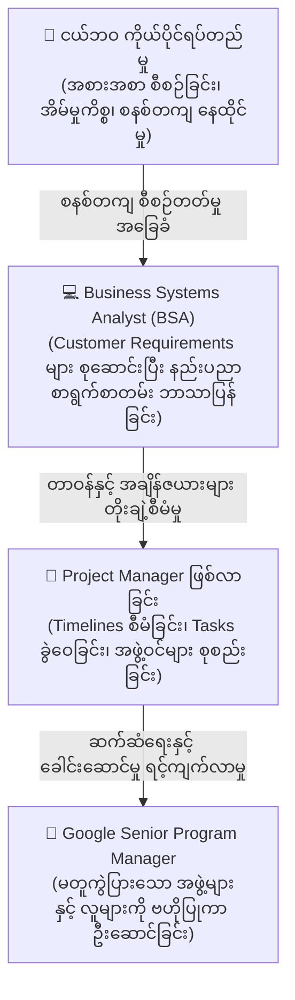
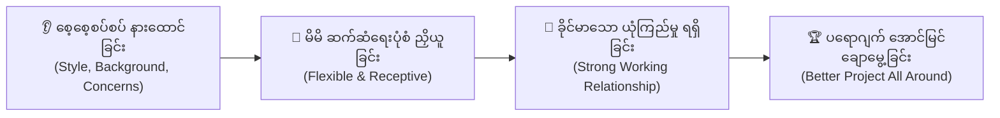

# Lesson 2.3: JuAnne: Path to Becoming a Project Manager
*(JuAnne ၏ PM ဖြစ်လာပုံ ခရီးလမ်း: Business Systems Analyst မှသည် Google Senior Program Manager ဆီသို့)*

- **Course:** Google Project Management Certificate - Course 1: Foundations of Project Management
- **Module:** Module 2 - Becoming an effective project manager
- **Speaker:** JuAnne (Senior Program Manager at Google)
- **Topic:** First-generation Immigrant Background, Childhood Independence, BSA to PM Career Transition, People-First Management, and Adaptive Communication

---

## 📌 ၁။ အနှစ်ချုပ် မှတ်စု (Quick Summary & Key Takeaways)

::: tip 💡 မျက်စိထဲ တစ်ချက်ကြည့်ရုံဖြင့် မှတ်သားနိုင်သော အနှစ်ချုပ်
- **JuAnne ၏ နောက်ခံဘဝ (Background):** အမေရိကန်သို့ ငယ်စဉ်က မိသားစုနှင့်အတူ ပြောင်းရွှေ့လာသော ပထမမျိုးဆက် တရုတ်နွယ်ဖွား အမေရိကန်နိုင်ငံသူ (First-generation Chinese American) တစ်ဦးဖြစ်ပြီး၊ မိဘများ အလုပ်ကြိုးစားရုန်းကန်နေရချိန်တွင် အစားအသောက် စီစဉ်ခြင်း၊ အိမ်စာလုပ်ခြင်း၊ အိမ်မှုကိစ္စ ထိန်းသိမ်းခြင်းတို့ကို တစ်ကိုယ်တည်း တာဝန်ယူ လုပ်ဆောင်ခဲ့ရခြင်းမှ စနစ်တကျ စီစဉ်တတ်သော Program Management စွမ်းရည် အခြေခံကောင်းများ စတင်ရရှိခဲ့သည်။
- **BSA မှ PM သို့ ကူးပြောင်းလာပုံ (BSA to PM Transition):** 
  - သူမ၏ PM ခရီးလမ်းသည် **Business Systems Analyst (BSA)** အဖြစ် စတင်ခဲ့သည်။
  - ဖောက်သည်များထံမှ လိုအပ်ချက်များ (Requirements) ကို မေးမြန်းစုဆောင်းပြီး၊ ဆော့ဖ်ဝဲလ် အင်ဂျင်နီယာများ လက်တွေ့အကောင်အထည်ဖော် (Implement) နိုင်စေရန် နည်းပညာ စာရွက်စာတမ်းများ (Documentation) အဖြစ် ဘာသာပြန် ရေးသားပေးခဲ့သည်။
  - ထိုမှတစ်ဆင့် အချိန်ဇယားများ (Timelines) နှင့် လုပ်ငန်းတာဝန်များ (Tasks) ကို စီမံခန့်ခွဲခြင်း၊ အစိတ်အပိုင်းအားလုံးကို ချိတ်ဆက်နားလည်ခြင်းနှင့် မည်သူတွေ ပါဝင်ဆောင်ရွက်ရမည်ကို စီစဉ်ရင်း သဘာဝအလျောက် အောင်မြင်သော Project Manager ဖြစ်လာခဲ့သည်။
- **PM အလုပ်၏ အပျော်ဆုံးအပိုင်း - လူများနှင့် လက်တွဲရခြင်း (Working with People):**
  - စိတ်နေစိတ်ထားနှင့် စရိုက် မတူညီသော လူပေါင်းစုံနှင့် တွေ့ဆုံလက်တွဲရခြင်းသည် PM အလုပ်၏ အနှစ်သာရ အရှိဆုံး ဖြစ်သည်။
  - လူသားများ၏ အပြုအမူနှင့် အချင်းချင်း ဆက်ဆံပုံ (Human dynamics & behavior) ကို လေ့လာရခြင်းသည် အလွန်စိတ်ဝင်စားဖွယ် ကောင်းသည်။
- **လိုက်လျောညီထွေရှိသော ဆက်ဆံရေး (Adaptive Communication):**
  - ရင်းနှီးသော လုပ်ငန်းခွင် ဆက်ဆံရေး (Relationship) တည်ဆောက်ခြင်းကို ဦးစားပေးပါ။
  - တစ်ဖက်လူ၏ စရိုက်၊ စိုးရိမ်ပူပန်မှုများနှင့် နောက်ခံအခြေအနေကို နားလည်အောင် ကြိုးစားပြီး၊ ၎င်းတို့ အလွယ်တကူ လက်ခံသဘောပေါက်နိုင်မည့် ပုံစံမျိုးဖြင့် **လိုက်လျောညီထွေ ပြောင်းလဲဆက်သွယ်ခြင်း (Communicating in a receptive style)** သည် ပရောဂျက်တစ်ခုလုံးကို အဘက်ဘက်မှ ပိုမိုကောင်းမွန်စေပါသည်။
:::

---

## 📖 ၂။ အပြည့်အစုံ ဘာသာပြန်နှင့် ရှင်းလင်းချက် (Bilingual Study Cards)

  

    📌 အပိုင်း (၁): ကလေးဘဝ တစ်ကိုယ်တည်းရပ်တည်မှုနှင့် စီစဉ်ညှိနှိုင်းမှု စွမ်းရည်အခြေခံ (Immigrant Background & Early Organization)
  

  

    

      
🇬🇧 Original English

      
My name is JuAnne. I'm a Senior Program Manager at Google. I'm a first-generation Chinese American. My family and I came to the United States when I was young.

      
My parents worked really hard when I was growing up and I spent a lot of time by myself, basically just having to take care of myself; planning my meals, doing my homework, taking care of chores. I feel like I got a little bit of my program management skills from just being really organized, having to be really organized all the time.

    

    

      
🇲🇲 မြန်မာပြန်နှင့် ရှင်းလင်းချက်

      
ကျွန်မနာမည် JuAnne ဖြစ်ပါတယ်။ Google မှာ Senior Program Manager တစ်ဦးအဖြစ် တာဝန်ထမ်းဆောင်နေပါတယ်။ ကျွန်မဟာ ပထမမျိုးဆက် တရုတ်နွယ်ဖွား အမေရိကန်နိုင်ငံသူ (First-generation Chinese American) တစ်ဦး ဖြစ်ပြီး၊ ကျွန်မတို့ မိသားစုဟာ ကျွန်မငယ်ငယ်ကတည်းက အမေရိကန်ပြည်ထောင်စုကို ရွှေ့ပြောင်းအခြေချခဲ့ကြတာပါ။

      
ကျွန်မ ကြီးပြင်းလာချိန်မှာ မိဘတွေဟာ အရမ်းကို ကြိုးစားရုန်းကန် အလုပ်လုပ်ခဲ့ကြရတဲ့အတွက် ကျွန်မဟာ အချိန်အများစုကို တစ်ယောက်တည်း ကုန်ဆုံးခဲ့ရပါတယ်။ အခြေခံအားဖြင့် မိမိကိုယ်မိမိ ပြန်လည်စောင့်ရှောက်ရင်း စားသောက်မယ့် အစားအစာတွေကို ကြိုတင်စီစဉ်ရခြင်း၊ ကျောင်းအိမ်စာတွေကို ကိုယ်တိုင်လုပ်ဆောင်ရခြင်းနဲ့ အိမ်မှုကိစ္စတွေကို ထိန်းသိမ်းရခြင်းတွေ လုပ်ခဲ့ရပါတယ်။ အမြဲတစေ စနစ်တကျ စီစဉ်စုစည်းတတ်အောင် (Really organized) မဖြစ်မနေ လေ့ကျင့်ခဲ့ရတဲ့ ဒီအလေ့အကျင့်တွေကနေပဲ ကျွန်မရဲ့ Program Management စွမ်းရည်အခြေခံတွေကို အစပြုရရှိခဲ့တယ်လို့ ခံစားရပါတယ်။

    

  

  

    📌 အပိုင်း (၂): Business Systems Analyst မှ PM ဖြစ်လာပုံ (BSA to PM Transition)
  

  

    

      
🇬🇧 Original English

      
My path to being a project manager really started as a business systems analyst. I was writing requirements or gathering requirements for our customers and translating them into documentation for our engineers so that they could implement it.

      
Through that process, I became a project manager. I started to manage the timelines, manage the tasks, understand all the pieces, and who needed to be involved. There you go, you have a project manager.

    

    

      
🇲🇲 မြန်မာပြန်နှင့် ရှင်းလင်းချက်

      
ကျွန်မ Project Manager တစ်ယောက် ဖြစ်လာမယ့် လမ်းကြောင်းဟာ <strong>Business Systems Analyst (စီးပွားရေးနှင့် စနစ်ပိုင်းဆိုင်ရာ သုံးသပ်သူ)</strong> တစ်ဦးအဖြစ်ကနေ အမှန်တကယ် စတင်ခဲ့တာပါ။ ကျွန်မဟာ ဖောက်သည်တွေ လိုအပ်တဲ့ အချက်အလက်တွေကို စုဆောင်းမေးမြန်းခြင်း <strong>(Gathering requirements)</strong> နဲ့ အင်ဂျင်နီယာတွေ လက်တွေ့ တည်ဆောက်အကောင်အထည်ဖော် <strong>(Implement)</strong> နိုင်အောင် နည်းပညာ စာရွက်စာတမ်း မှတ်တမ်းများ <strong>(Documentation)</strong> အဖြစ် ဘာသာပြန် ရေးသားပေးရတဲ့ အလုပ်ကို လုပ်ခဲ့ပါတယ်။

      
အဲဒီ လုပ်ငန်းစဉ်ကနေတစ်ဆင့် ကျွန်မဟာ Project Manager တစ်ယောက် ဖြစ်လာခဲ့ပါတယ်။ ပရောဂျက် အချိန်ဇယားတွေကို စီမံခန့်ခွဲလာတယ်၊ လုပ်ငန်းတာဝန်တွေကို ကြီးကြပ်တယ်၊ အစိတ်အပိုင်းအားလုံး ချိတ်ဆက်နေပုံကို နားလည်လာပြီး မည်သူတွေ ပါဝင်လုပ်ဆောင်ရမယ်ဆိုတာကိုပါ စီစဉ်ပေးလာခဲ့ပါတယ်။ ဒီလိုနဲ့ပဲ ပရောဂျက် မန်နေဂျာတစ်ယောက် အလိုလို ဖြစ်ပေါ်လာခဲ့တာပါပဲ။

    

  

  

    📌 အပိုင်း (၃): PM ၏ အပျော်ဆုံးအပိုင်း - မတူကွဲပြားသော လူများနှင့် လက်တွဲရခြင်း (Working with People)
  

  

    

      
🇬🇧 Original English

      
I think the funnest part about being a project manager is really working with people. You get to meet all different kinds of people, different personalities. Sometimes you get to travel to places to meet them but even when you don't, just meeting new people and understanding how we interact, how people interact and behave is fascinating.

    

    

      
🇲🇲 မြန်မာပြန်နှင့် ရှင်းလင်းချက်

      
Project Manager တစ်ယောက်ဖြစ်ရတဲ့ အပျော်ရွှင်ဆုံး အပိုင်းဟာ <strong>လူတွေနဲ့ လက်တွဲလုပ်ကိုင်ရခြင်း</strong> ဖြစ်တယ်လို့ ကျွန်မ ထင်ပါတယ်။ စရိုက်လက္ခဏာ (Personalities) မတူညီတဲ့ လူပေါင်းစုံနဲ့ တွေ့ဆုံခွင့်ရပါတယ်။ တစ်ခါတလေမှာ သူတို့နဲ့ တွေ့ဆုံဖို့ ခရီးတွေ သွားရောက်ရတတ်သလို၊ ခရီးမသွားရရင်တောင်မှ လူသစ်တွေနဲ့ တွေ့ဆုံရခြင်း၊ လူတွေ အချင်းချင်း ဘယ်လို အပြန်အလှန် ဆက်ဆံကြသလဲနဲ့ ဘယ်လို ပြုမူပြောဆိုကြသလဲဆိုတာကို နားလည်ရတာဟာ တကယ့်ကို စိတ်ဝင်စားဖွယ် (Fascinating) ကောင်းလှပါတယ်။

    

  

  

    📌 အပိုင်း (၄): ရင်းနှီးမှုတည်ဆောက်ခြင်းနှင့် လိုက်လျောညီထွေရှိသော ဆက်ဆံရေးပုံစံ (Relationship Building & Adaptive Communication)
  

  

    

      
🇬🇧 Original English

      
I think if you build a relationship, focus on the relationship, and really understand what their style, where they're coming from, what their concerns are, it will help your working relationship much better.

      
You can communicate with them in the style that's necessary. You can work with them in the style that's more receptive to them and that would just make the project better all around.

    

    

      
🇲🇲 မြန်မာပြန်နှင့် ရှင်းလင်းချက်

      
ကျွန်မ အမြင်အရဆိုရင် သင့်အနေနဲ့ အဖွဲ့သားတွေနဲ့ ရင်းနှီးတဲ့ ဆက်ဆံရေးတစ်ခုကို တည်ဆောက်မယ်၊ အဲဒီ ဆက်ဆံရေးအပေါ် အာရုံစိုက်မယ်၊ ပြီးတော့ သူတို့ရဲ့ ဆက်ဆံရေး ပုံစံက ဘာလဲ၊ သူတို့ရဲ့ နောက်ခံအခြေအနေက ဘာလဲနဲ့ သူတို့မှာ ဘယ်လို စိုးရိမ်ပူပန်မှုတွေ ရှိနေသလဲဆိုတာကို အမှန်တကယ် နားလည်အောင် ကြိုးစားမယ်ဆိုရင်၊ ဒါဟာ သင့်ရဲ့ <strong>လုပ်ငန်းခွင် ဆက်ဆံရေး (Working relationship)</strong> ကို များစွာ ပိုမိုကောင်းမွန်လာစေပါလိမ့်မယ်။

      
ဒါဆိုရင် သင်ဟာ သူတို့နဲ့ လိုအပ်တဲ့ ပုံစံအတိုင်း ထိရောက်စွာ ဆက်သွယ်နိုင်မှာ ဖြစ်သလို၊ သူတို့အတွက် အလွယ်တကူ လက်ခံနိုင်ဆုံးဖြစ်မယ့် <strong>(More receptive)</strong> ပုံစံမျိုးနဲ့ အတူတကွ လက်တွဲ အလုပ်လုပ်နိုင်ပါလိမ့်မယ်။ အဲဒီလို လုပ်ဆောင်နိုင်ခြင်းက ပရောဂျက်တစ်ခုလုံးကို အဘက်ဘက်ကနေ ပိုမိုတိုးတက် ကောင်းမွန်စေမှာ ဖြစ်ပါတယ်။

    

  

---

## 📊 ၃။ လက်တွေ့ ဘဝနှင့် အလုပ်အကိုင် အဆင့်ဆင့် ကူးပြောင်းမှု လမ်းပြမြေပုံ (Career Evolution)

JuAnne ၏ ဘဝခရီးလမ်းသည် ပုဂ္ဂိုလ်ရေး ဘဝအလေ့အကျင့်မှသည် နည်းပညာနယ်ပယ်၊ ထိုမှတစ်ဆင့် Google ၏ Senior Program Manager ဖြစ်လာပုံကို ထင်ရှားစွာ ပြသနေပါသည်။

### 📋 Business Systems Analyst (BSA) vs. Project Manager (PM) နှိုင်းယှဉ်ချက်ဇယား

| ကဏ္ဍ (Aspect) | Business Systems Analyst (BSA) | Project Manager (PM) |
|---|---|---|
| **အဓိက အာရုံစိုက်ရာ (Focus)** | စနစ်၏ လိုအပ်ချက်များ (System Requirements) နှင့် ဖောက်သည်၏ စီးပွားရေး လိုလားချက်များ။ | ပရောဂျက်တစ်ခုလုံး၏ အချိန်ဇယား၊ ဘတ်ဂျက်၊ အရင်းအမြစ်များနှင့် အောင်မြင်သော ရလဒ်။ |
| **လုပ်ဆောင်ရမည့် အလုပ် (Duties)** | Requirements gathering, Technical documentation ရေးသားခြင်း၊ Engineer များနှင့် ညှိနှိုင်းခြင်း။ | Timelines & Tasks စီမံခြင်း၊ Stakeholder alignment၊ Risk & Issue management၊ အဖွဲ့ကို ဦးဆောင်လမ်းပြခြင်း။ |
| **အောင်မြင်မှု တိုင်းတာချက်** | စနစ်သည် ဖောက်သည်လိုအပ်ချက်နှင့် ကိုက်ညီပြီး အမှားအယွင်းမရှိ အလုပ်လုပ်နိုင်ခြင်း။ | ပရောဂျက်သည် သတ်မှတ်ချိန်၊ သတ်မှတ်ဘတ်ဂျက်အတွင်း အဖွဲ့အားလုံး ကျေနပ်စွာ ပြီးမြောက်ခြင်း။ |

### 💡 JuAnne ၏ လူဗဟိုပြု ဆက်ဆံရေး မူဘောင် (Adaptive Communication Framework)

---

## 📜 ၄။ မူရင်း စာသား အပြည့်အစုံ (Verbatim English Transcript)

::: details 📜 Original English Transcript (မူရင်းအင်္ဂလိပ်စာသား အပြည့်အစုံ)
My name is JuAnne. I'm a Senior Program Manager at Google. I'm a first-generation Chinese American. My family and I came to the United States when I was young. My parents worked really hard when I was growing up and I spent a lot of time by myself, basically just having to take care of myself; planning my meals, doing my homework, taking care of chores. I feel like I got a little bit of my program management skills from just being really organized, having to be really organized all the time. My path to being a project manager really started as a business systems analyst. 

I was writing requirements or gathering requirements for our customers and translating them into documentation for our engineers so that they could implement it. Through that process, I became a project manager. I started to manage the timelines, manage the tasks, understand all the pieces, and who needed to be involved. There you go, you have a project manager. I think the funnest part about being a project manager is really working with people. You get to meet all different kinds of people, different personalities. Sometimes you get to travel to places to meet them but even when you don't, just meeting new people and understanding how we interact, how people interact and behave is fascinating. 

I think if you build a relationship, focus on the relationship, and really understand what their style, where they're coming from, what their concerns are, it will help your working relationship much better. You can communicate with them in the style that's necessary. You can work with them in the style that's more receptive to them and that would just make the project better all around.
:::

---

## 🔤 ၅။ အရေးကြီး ဝေါဟာရဘဏ် (Vocabulary Bank)

| စကားလုံး (Term) | အမျိုးအစား | အင်္ဂလိပ် အဓိပ္ပာယ်ဖွင့်ဆိုချက် | မြန်မာပြန်ဆိုချက် |
|---|---|---|---|
| **First-generation** | Adjective / Noun | The first generation of a family to be born in or immigrate to a new country. | နိုင်ငံသစ်သို့ ပထမဆုံး စတင်ရွှေ့ပြောင်း အခြေချလာသော မျိုးဆက်။ |
| **Business Systems Analyst (BSA)** | Noun Phrase | A professional who analyzes business needs and translates them into technical requirements and specifications for developers. | ဖောက်သည်၏ စီးပွားရေး လိုအပ်ချက်များကို နည်းပညာ စနစ်အဖြစ် အကောင်အထည်ဖော်နိုင်ရန် သုံးသပ်ချိတ်ဆက်ပေးသူ။ |
| **Gathering Requirements** | Noun Phrase | The process of identifying, collecting, and defining the specific needs and expectations of project stakeholders and users. | ပရောဂျက်တစ်ခုတွင် အသုံးပြုသူနှင့် ဖောက်သည်တို့ လိုလားသော လိုအပ်ချက် အသေးစိတ်များကို စုဆောင်းမေးမြန်းခြင်း။ |
| **Documentation** | Noun | Written, formal records or specifications describing software functions, project plans, and architectural requirements. | ဆော့ဖ်ဝဲလ် သို့မဟုတ် ပရောဂျက်ဆိုင်ရာ နည်းပညာ အသေးစိတ်ကို ရေးသားထားသော တရားဝင် စာရွက်စာတမ်း မှတ်တမ်းများ။ |
| **Implement** | Verb | To put a decision, plan, software design, or system into practical effect or execution. | လက်တွေ့ တည်ဆောက်သည်၊ အကောင်အထည်ဖော် ဆောင်ရွက်သည်။ |
| **Fascinating** | Adjective | Extremely interesting, captivating, and engaging. | အလွန်စိတ်ဝင်စားဖွယ် ကောင်းသော၊ စွဲမက်ဖွယ် ဖြစ်သော။ |
| **Receptive** | Adjective | Willing to consider or accept new suggestions, ideas, and communication styles favorably. | အကြံပြုချက်နှင့် ဆက်ဆံပြောဆိုမှုများကို လွယ်ကူစွာ လက်ခံနားထောင်နိုင်သော။ |
| **Working Relationship** | Noun Phrase | The interpersonal and professional connection, trust, and collaboration between colleagues or stakeholders. | လုပ်ဖော်ကိုင်ဖက်များနှင့် အကျိုးတူ သက်ဆိုင်သူများအကြား တည်ဆောက်ထားသော လုပ်ငန်းခွင် ဆက်ဆံရေး။ |

---

## ❓ ၆။ အသိစမ်းစစ်ချက် မေးခွန်းများ (Self-Review Knowledge Check)

### မေးခွန်း (၁): JuAnne သည် Business Systems Analyst ဘဝမှ Project Manager ဖြစ်လာစေရန် မည်သည့် လုပ်ငန်းတာဝန်များကို စတင် တိုးချဲ့စီမံခန့်ခွဲခဲ့သနည်း။
- (က) ဆော့ဖ်ဝဲလ် အင်ဂျင်နီယာများအစား ကိုယ်တိုင် ကုဒ်ဝင်ရေးခြင်း
- (ခ) ပရောဂျက် အချိန်ဇယားများ (Timelines)၊ အလုပ်တာဝန်များ (Tasks) ကို စီမံခြင်းနှင့် မည်သူတွေ ပါဝင်ရမည်ကို စီစဉ်ဆောင်ရွက်ခြင်း
- (ဂ) ကုမ္ပဏီတစ်ခုလုံး၏ ဘဏ္ဍာရေး စာရင်းစစ် အဖြစ် ပြောင်းလဲလုပ်ကိုင်ခြင်း
- (ဃ) ဖောက်သည်များနှင့် လုံးဝအဆက်အသွယ် ဖြတ်တောက်လိုက်ခြင်း

::: details 💡 အဖြေမှန်နှင့် ရှင်းလင်းချက်ကို ကြည့်ရန်
**အဖြေမှန်:** **(ခ)**  
**ရှင်းလင်းချက်:** JuAnne သည် ဖောက်သည်များထံမှ Requirements များ စုဆောင်းရာမှတစ်ဆင့် အချိန်ဇယားများ (Timelines)၊ လုပ်ငန်းတာဝန်များ (Tasks)၊ အစိတ်အပိုင်းအားလုံး ချိတ်ဆက်နေပုံနှင့် မည်သူတွေ ပါဝင်လုပ်ဆောင်ရမည်ကို စီမံခန့်ခွဲရင်း သဘာဝအလျောက် Project Manager အဖြစ်သို့ ကူးပြောင်းရောက်ရှိလာခဲ့ခြင်း ဖြစ်ပါသည်။
:::

### မေးခွန်း (၂): JuAnne ၏ အကြံပြုချက်အရ လုပ်ငန်းခွင် ဆက်ဆံရေး ပိုမိုကောင်းမွန်စေရန် PM တစ်ဦးအနေဖြင့် လုပ်ဖော်ကိုင်ဖက်များနှင့် ဆက်ဆံရာတွင် မည်သို့ ပြုမူသင့်သနည်း။
- (က) မိမိပြောချင်သည့် ပုံစံတစ်ခုတည်းဖြင့်သာ အမိန့်ပေး ပြောဆိုဆက်ဆံခြင်း
- (ခ) တစ်ဖက်လူ၏ စရိုက်၊ စိုးရိမ်ပူပန်မှုများနှင့် နောက်ခံကို နားလည်အောင်ကြိုးစားပြီး၊ ၎င်းတို့ အလွယ်တကူ လက်ခံနိုင်မည့် (Receptive) ပုံစံဖြင့် လိုက်လျောညီထွေ ဆက်သွယ်ခြင်း
- (ဂ) လူများနှင့် တွေ့ဆုံစကားပြောဆိုခြင်း မပြုဘဲ အီးမေးလ်တစ်ခုတည်းဖြင့်သာ အလုပ်လုပ်ခြင်း
- (ဃ) အဖွဲ့သားများနှင့် ပုဂ္ဂိုလ်ရေး ဆက်ဆံရေး တည်ဆောက်ခြင်းကို အချိန်ဖြုန်းသည်ဟု ယူဆခြင်း

::: details 💡 အဖြေမှန်နှင့် ရှင်းလင်းချက်ကို ကြည့်ရန်
**အဖြေမှန်:** **(ခ)**  
**ရှင်းလင်းချက်:** JuAnne က အဖွဲ့သားများ၏ စရိုက် (Style)၊ နောက်ခံ (Where they're coming from) နှင့် စိုးရိမ်မှု (Concerns) များကို နားလည်ပြီး၊ ၎င်းတို့ အလွယ်တကူ လက်ခံနားထောင်နိုင်မည့် ပုံစံမျိုးဖြင့် လိုက်လျောညီထွေ ပြောင်းလဲဆက်ဆံခြင်း (Adaptive & receptive communication) သည် လုပ်ငန်းခွင် ဆက်ဆံရေးကို ပိုမိုခိုင်မာစေပြီး ပရောဂျက်ကို အောင်မြင်စေသည်ဟု အလေးထား အကြံပြုထားပါသည်။
:::

