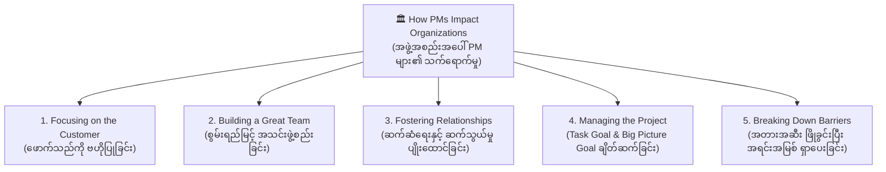

# Lesson 2.4: How Project Managers Impact Organizations
*(Project Manager များသည် အဖွဲ့အစည်းများအပေါ် မည်သို့ ကောင်းကျိုးသက်ရောက်မှု ပေးနိုင်သနည်း)*

- **Course:** Google Project Management Certificate - Course 1: Foundations of Project Management
- **Module:** Module 2 - Becoming an effective project manager
- **Type:** Reading (စာဖတ်လေ့လာမှု သင်ခန်းစာ)
- **Topic:** 5 Ways PMs Add Value & Impact Organizations, Customer Discovery Questions, Internal vs. External Customers, Big Picture Goal, and Breaking Down Barriers

---

## 📌 ၁။ အနှစ်ချုပ် မှတ်စု (Quick Summary & Key Takeaways)

::: tip 💡 မျက်စိထဲ တစ်ချက်ကြည့်ရုံဖြင့် မှတ်သားနိုင်သော အနှစ်ချုပ်
- **PM များ အဖွဲ့အစည်းအပေါ် ကောင်းကျိုးသက်ရောက်စေသည့် အဓိက မဏ္ဍိုင် ၅ ရပ် (5 Ways PMs Impact Organizations):**
  1. **Focusing on the customer (ဖောက်သည်ကို ဗဟိုပြု အာရုံစိုက်ခြင်း):** ဖောက်သည်၏ လိုအပ်ချက်များ (Requirements) နှင့် ဘတ်ဂျက်/ရက်စွဲ စည်းမျဉ်းများကို ရှင်းလင်းစွာ နားလည်အောင် ဆောင်ရွက်ခြင်း။
     - **Internal Customers:** ကုမ္ပဏီအတွင်းပိုင်းမှ သက်ဆိုင်သူများ (စီမံခန့်ခွဲမှုအဖွဲ့၊ ပရောဂျက်အဖွဲ့ဝင်များ၊ အခြားဌာနများ)။
     - **External Customers:** ကုမ္ပဏီပြင်ပမှ သက်ဆိုင်သူများ (Clients အပ်နှံသူများ၊ ကန်ထရိုက်တာများ၊ ပစ္စည်းတင်သွင်းသူများ၊ စားသုံးသူများ)။
  2. **Building a great team (စွမ်းဆောင်ရည်မြင့် အသင်းတစ်သင်း တည်ဆောက်ခြင်း):** အဖွဲ့သည် ပရောဂျက်၏ အကြီးမားဆုံး အရင်းအနှီး (Biggest asset) ဖြစ်သည်။ အဖွဲ့ဝင်တစ်ဦးချင်းစီ၏ အားသာချက်/အားနည်းချက်များကို နားလည်ပြီး ပရောဂျက်လိုအပ်ချက်နှင့် ကိုက်ညီသော စွမ်းရည်ရှိသူများကို နေရာချထားခြင်း (ဥပမာ- ဆေးဘက်ဆိုင်ရာ ပရောဂျက်အတွက် ဆေးပညာနောက်ခံရှိသူများ ရွေးချယ်ခြင်း)။ အဖွဲ့ဝင်များအား ယုံကြည်တန်ဖိုးထားကြောင်း ပြသခြင်း။
  3. **Fostering relationships and communication (ဆက်ဆံရေးနှင့် ဆက်သွယ်မှုကို ပျိုးထောင်ခြင်း):** စာနာနားလည်မှုနှင့် လေးစားမှုဖြင့် ဆက်ဆံခြင်း။ အဖွဲ့သားများနှင့် နေ့စဉ် အခြေအနေမေးမြန်း စစ်ဆေးခြင်း (Daily check-ins) ပြုလုပ်ပြီး လိုအပ်သော အကူအညီများကို ချက်ချင်း ဖြေရှင်းပေးခြင်း။
  4. **Managing the project (ပရောဂျက်ကို ခြုံငုံစီမံခြင်း - Big Picture Goal):** အဖွဲ့သားများသည် မိမိလုပ်ရမည့် အပိုင်းတစ်ခုတည်းကိုသာ မြင်လေ့ရှိသော်လည်း၊ PM က တစ်ဖွဲ့လုံးသို့ ပရောဂျက်၏ မျက်နှာကျက်ကျယ် ခြုံငုံရည်မှန်းချက် (Big Picture Goal) ကို ရှင်းပြပေးရသည် (ဥပမာ- ဒီဇိုင်နာတစ်ဦးအား ဤကမ်ပိန်းသည် ပညာရေးဆရာများကို ဆွဲဆောင်ရန်ဖြစ်ကြောင်း ကြိုတင်ရှင်းပြထားခြင်း)။
  5. **Breaking down barriers (အတားအဆီးနှင့် နံရံများကို ဖြိုခွင်းပေးခြင်း):** *"ဒီအတိုင်းပဲ အမြဲလုပ်လာတာ"* ဆိုသည့် ရိုးရာအစဉ်အလာ အတားအဆီးများကို ချိုးဖျက်ပြီး ဆန်းသစ်တီထွင်မှု (Ingenuity) နှင့် ပူးပေါင်းဆောင်ရွက်မှုကို အားပေးခြင်း။ အဖွဲ့အတွက် လိုအပ်သော အရင်းအမြစ်များ ထပ်မံရရှိအောင် တောင်းဆိုပေးခြင်း (Advocate for resources) နှင့် ပြင်ပဌာနများထံမှ အဖြေရရန် ကြားဝင်ညှိနှိုင်းပေးခြင်း။
:::

---

## 📖 ၂။ အပြည့်အစုံ ဘာသာပြန်နှင့် ရှင်းလင်းချက် (Bilingual Study Cards)

  

    📌 အပိုင်း (၁): အဖွဲ့အစည်းအပေါ် အကျိုးသက်ရောက်စေသည့် နည်းလမ်း ၅ သွယ်နှင့် Customer သဘောတရား
  

  

    

      
🇬🇧 Original English

      
You have learned that project managers can prioritize, delegate, and effectively communicate to deliver value to their projects. This reading will focus on the main ways that project managers can add value to projects and impact organizations, which include:

      <ul>
        <li>Focusing on the customer</li>
        <li>Building a great team</li>
        <li>Fostering relationships and communication</li>
        <li>Managing the project</li>
        <li>Breaking down barriers</li>
      </ul>
      
Customers are always a key element to success in any business. There is no exception to that in the field of project management. In project management, the word “customer” refers to a person or an organization that defines the requirements of the project and sets important guidelines, such as budget and deadlines.

      
In projects, customers can be internal or external. Internal customers are stakeholders within your organization, such as management, project team members, resource managers, and other organizational departments. External customers are customers outside of your organization, such as clients, contractors, suppliers, and consumers.

      
To successfully deliver a project, it has to meet the customer’s standards. To meet the customer’s standards, you have to make sure you clearly understand their expectations. The customer is at the center of a successful project. Project managers can add a lot of value to the project by building relationships with customers and taking the time to make sure the customer is heard and satisfied with the result.

    

    

      
🇲🇲 မြန်မာပြန်နှင့် ရှင်းလင်းချက်

      
Project Manager များသည် မိမိတို့၏ ပရောဂျက်များထံ တန်ဖိုးပေးစွမ်းနိုင်ရန် ဦးစားပေးသတ်မှတ်ခြင်း (Prioritize)၊ တာဝန်ခွဲဝေခြင်း (Delegate) နှင့် ထိရောက်စွာ ဆက်သွယ်ပြောဆိုခြင်း (Effectively communicate) တို့ကို ဆောင်ရွက်နိုင်ကြောင်း သင်ယူခဲ့ပြီး ဖြစ်ပါသည်။ ဤစာဖတ်လေ့လာမှုသည် PM များက ပရောဂျက်များတွင် တန်ဖိုးဖြည့်ဆည်းပေးပြီး <strong>အဖွဲ့အစည်းများအပေါ် အကျိုးသက်ရောက်မှု ပေးနိုင်သည့် အဓိက နည်းလမ်း ၅ သွယ်</strong> ကို ဦးတည်ဖော်ပြထားပါသည်-

      <ul>
        <li><strong>ဖောက်သည်ကို ဗဟိုပြု အာရုံစိုက်ခြင်း (Focusing on the customer)</strong></li>
        <li><strong>စွမ်းဆောင်ရည်မြင့် အသင်းတစ်သင်း တည်ဆောက်ခြင်း (Building a great team)</strong></li>
        <li><strong>ဆက်ဆံရေးနှင့် ဆက်သွယ်မှုကို ပျိုးထောင်ပေးခြင်း (Fostering relationships and communication)</strong></li>
        <li><strong>ပရောဂျက်တစ်ခုလုံးကို ခြုံငုံစီမံခန့်ခွဲခြင်း (Managing the project)</strong></li>
        <li><strong>အတားအဆီး အဟန့်အတားများကို ဖြိုခွင်းပေးခြင်း (Breaking down barriers)</strong></li>
      </ul>
      
ဖောက်သည်များသည် မည်သည့် စီးပွားရေးလုပ်ငန်းတွင်မဆို အောင်မြင်မှု၏ အဓိက သော့ချက်ဖြစ်ပြီး Project Management တွင်လည်း ချွင်းချက်မရှိပါ။ Project Management တွင် <strong>"Customer (ဖောက်သည်)"</strong> ဟူသော ဝေါဟာရသည် ပရောဂျက်၏ လိုအပ်ချက်များ (Requirements) ကို သတ်မှတ်ပေးပြီး ဘတ်ဂျက်နှင့် သတ်မှတ်ရက်များကဲ့သို့ အရေးကြီးသော စည်းမျဉ်းဘောင်များကို ချမှတ်ပေးသည့် လူပုဂ္ဂိုလ် သို့မဟုတ် အဖွဲ့အစည်းကို ရည်ညွှန်းပါသည်။

      
ပရောဂျက်များတွင် ဖောက်သည်များကို အတွင်းပိုင်း (Internal) သို့မဟုတ် ပြင်ပ (External) ဟူ၍ ခွဲခြားနိုင်ပါသည်-

      <ul>
        <li><strong>Internal Customers (အတွင်းပိုင်း ဖောက်သည်များ):</strong> ကုမ္ပဏီအဖွဲ့အစည်း အတွင်းရှိ အကျိုးတူ သက်ဆိုင်သူများ (ဥပမာ- စီမံခန့်ခွဲမှု အထက်လူကြီးများ၊ ပရောဂျက် အဖွဲ့ဝင်များ၊ အရင်းအမြစ် မန်နေဂျာများနှင့် အခြားသော ဌာနများ)။</li>
        <li><strong>External Customers (ပြင်ပ ဖောက်သည်များ):</strong> ကုမ္ပဏီအဖွဲ့အစည်း ပြင်ပရှိ ဖောက်သည်များ (ဥပမာ- အလုပ်အပ်နှံသည့် Clients များ၊ ကန်ထရိုက်တာများ၊ ပစ္စည်းရောင်းချသူ Suppliers များနှင့် ကုန်ပစ္စည်းသုံးစွဲသူ Consumers များ)။</li>
      </ul>
      
ပရောဂျက်တစ်ခုကို အောင်မြင်စွာ အပ်နှံနိုင်ရန် ဖောက်သည်၏ စံချိန်စံညွှန်းများနှင့် ကိုက်ညီရပါမည်။ ထိုသို့ ကိုက်ညီစေရန် ၎င်းတို့၏ မျှော်လင့်ချက်များကို ရှင်းလင်းစွာ နားလည်ထားရမည်။ ဖောက်သည်သည် အောင်မြင်သော ပရောဂျက်တစ်ခု၏ ဗဟိုချက်မတွင် ရှိနေပါသည်။ PM များသည် ဖောက်သည်များနှင့် ခိုင်မာသော ဆက်ဆံရေး တည်ဆောက်ခြင်း၊ ဖောက်သည်၏ အသံကို သေချာနားထောင်ပေးခြင်းနှင့် ရလဒ်အပေါ် စိတ်ကျေနပ်မှုရှိစေရန် အချိန်ပေး ဆောင်ရွက်ခြင်းဖြင့် ပရောဂျက်အပေါ် များစွာသော တန်ဖိုးကို ဖြည့်ဆည်းပေးနိုင်ပါသည်။

    

  

  

    📌 အပိုင်း (၂): ဖောက်သည်အား မေးမြန်းရမည့် မေးခွန်း ၄ ခုနှင့် "Why" ကို နက်နက်နဲနဲ ရှာဖွေခြင်း
  

  

    

      
🇬🇧 Original English

      
Let’s discuss how you can focus on the customer in a project. First, sit with the customer and ask what problem they are trying to solve. You might ask if they have a specific vision of the final outcome they would like delivered. Sometimes, customers will lean on project managers to find the solution to their problem. It’s your job to ask questions like:

      <ul>
        <li><strong>What is the problem you would like us to help solve?</strong> Example response: The customer wants help developing a new process that would allow their company to be more efficient.</li>
        <li><strong>How is the problem impacting your organization?</strong> Example response: The customer states that they are losing clients because of their current inefficient processes since clients are sometimes receiving their orders late.</li>
        <li><strong>What prompted you to ask for help now?</strong> Example response: The customer says that they may lose department funding if they do not improve efficiency.</li>
        <li><strong>What is your hope for the outcome of this project?</strong> Example response: The customer states that their ultimate goal is to increase the speed at which they fill orders without sacrificing quality.</li>
      </ul>
      
Taking the time to dig a little deeper into the “why” behind the project can help a project manager better support and understand the customer. The more you understand the customer’s goals, the more likely you will be able to produce what the customer is seeking.

    

    

      
🇲🇲 မြန်မာပြန်နှင့် ရှင်းလင်းချက်

      
ပရောဂျက်တစ်ခုတွင် ဖောက်သည်အပေါ် မည်သို့ အာရုံစိုက်ရမည်ကို ဆွေးနွေးကြစို့။ ပထမဦးစွာ ဖောက်သည်နှင့်အတူ ထိုင်ကာ ၎င်းတို့အနေဖြင့် မည်သည့် ပြဿနာကို ဖြေရှင်းရန် ကြိုးစားနေသနည်းဟု မေးမြန်းပါ။ နောက်ဆုံး ထွက်ပေါ်လာစေလိုသော ရလဒ်အပေါ် သီးသန့် မျှော်မှန်းချက် (Vision) ရှိမရှိ မေးမြန်းနိုင်ပါသည်။ တစ်ခါတရံ ဖောက်သည်များသည် ပြဿနာ၏ အဖြေကို ရှာဖွေရန် PM များအပေါ် အားကိုးတတ်ကြသည်။ ထိုအခါ အောက်ပါ မေးခွန်းမျိုးများကို မေးမြန်းရန်မှာ သင့်တာဝန် ဖြစ်ပါသည်-

      <ul>
        <li><strong>ကျွန်ုပ်တို့အား မည်သည့် ပြဿနာကို ကူညီဖြေရှင်းပေးစေလိုပါသလဲ?</strong> (နမူနာ အဖြေ- ကုမ္ပဏီ ပိုမိုလုပ်ငန်းတွင်ကျယ် ထိရောက်စေမည့် လုပ်ငန်းစဉ်အသစ်တစ်ခု ရေးဆွဲဖော်ထုတ်ပေးစေလိုခြင်း)။</li>
        <li><strong>ဤပြဿနာသည် သင့်အဖွဲ့အစည်းအပေါ် မည်သို့ ထိခိုက်သက်ရောက်နေပါသလဲ?</strong> (နမူနာ အဖြေ- လက်ရှိ လုပ်ငန်းစဉ်များ မထိရောက်သဖြင့် အမှာစာများ အချိန်မီမရောက်ဘဲ ဖောက်သည်ဟောင်းများ လက်လွတ်ဆုံးရှုံးနေရခြင်း)။</li>
        <li><strong>ယခုအချိန်တွင် အကူအညီတောင်းခံရန် မည်သည့်အကြောင်းရင်းက တွန်းအားပေးခဲ့ပါသလဲ?</strong> (နမူနာ အဖြေ- ထိရောက်မှုကို အမြန်မတိုးတက်စေပါက ဌာန၏ ဘတ်ဂျက်ရန်ပုံငွေများ ဖြတ်တောက်ခံရနိုင်သောကြောင့် ဖြစ်ခြင်း)။</li>
        <li><strong>ဤပရောဂျက်၏ ရလဒ်အပေါ် သင်၏ မျှော်လင့်ချက်မှာ အဘယ်နည်း?</strong> (နမူနာ အဖြေ- ကုန်ပစ္စည်း အရည်အသွေး မကျဆင်းစေဘဲ အမှာစာများ ပို့ဆောင်ဖြည့်ဆည်းသည့် အရှိန်ကို မြှင့်တင်လိုခြင်း)။</li>
      </ul>
      
ပရောဂျက်၏ နောက်ကွယ်ရှိ <strong>"အဘယ်ကြောင့် ပြုလုပ်ရသနည်း (Why)"</strong> ကို နက်နက်နဲနဲ အချိန်ယူ ရှာဖွေဖော်ထုတ်ခြင်းသည် PM တစ်ဦးအား ဖောက်သည်ကို ပိုမိုနားလည်စေပြီး အကောင်းဆုံး အထောက်အကူ ပေးနိုင်စေပါသည်။ ဖောက်သည်၏ ပန်းတိုင်များကို သင် ပိုမိုနားလည်လေလေ၊ ဖောက်သည် အမှန်တကယ် လိုလားနေသည့် ရလဒ်ကို အတိအကျ ဖန်တီးပေးနိုင်လေလေ ဖြစ်ပါလိမ့်မည်။

    

  

  

    📌 အပိုင်း (၃): စွမ်းဆောင်ရည်မြင့် အသင်းတစ်သင်း တည်ဆောက်ခြင်း (Building a Great Team)
  

  

    

      
🇬🇧 Original English

      
The team is a project’s biggest asset. A successful project manager knows that and takes the time to understand each person’s motivations, strengths, and weaknesses. Project managers add value to the project by identifying the right team for the project and enabling the team to be successful and make decisions.

      
When you work to build a great team, you have to consider the skills needed for the project, as well as the resources available. Understanding the customer’s requirements helps shape the skills needed for your team. If you are working on a project that requires people with medical expertise and you hire people who do not have a medical background, no matter how hard that team works, they will not have the right skill set to complete the project.

      
As project manager, you should bring on people with the right skills and ensure the team knows that each individual is valued, trusted, and appreciated. You can demonstrate how you feel about the team’s value by allowing them to have input and ask questions, and by addressing their needs as soon as possible.

    

    

      
🇲🇲 မြန်မာပြန်နှင့် ရှင်းလင်းချက်

      
<strong>အသင်းအဖွဲ့ (The team) သည် ပရောဂျက်တစ်ခု၏ အကြီးမားဆုံးသော တန်ဖိုးရှိ အရင်းအနှီး (Biggest asset) ဖြစ်သည်။</strong> အောင်မြင်သော PM တစ်ဦးသည် ထိုအချက်ကို ကောင်းစွာ သဘောပေါက်ပြီး အဖွဲ့ဝင်တစ်ဦးချင်းစီ၏ စိတ်အားထက်သန်မှု (Motivations)၊ အားသာချက်များနှင့် အားနည်းချက်များကို အချိန်ယူ လေ့လာနားလည်အောင် ဆောင်ရွက်သည်။ PM များသည် ပရောဂျက်အတွက် အကိုက်ညီဆုံး အဖွဲ့ကို ရှာဖွေဖွဲ့စည်းပေးခြင်း၊ အသင်းသားများ အောင်မြင်စေရန်နှင့် ဆုံးဖြတ်ချက်များ ကိုယ်တိုင်ချမှတ်နိုင်ရန် စွမ်းဆောင်ရည် မြှင့်တင်ပေးခြင်းဖြင့် တန်ဖိုးဖြည့်ဆည်းပေးကြသည်။

      
စွမ်းဆောင်ရည်မြင့် အသင်းတစ်သင်း တည်ဆောက်ရာတွင် ပရောဂျက်အတွက် လိုအပ်သော ကျွမ်းကျင်မှုများနှင့် ရရှိနိုင်သော အရင်းအမြစ်များကို ထည့်သွင်းစဉ်းစားရမည်။ ဖောက်သည်၏ လိုအပ်ချက်များကို နားလည်ခြင်းက သင့်အဖွဲ့အတွက် မည်သည့် ကျွမ်းကျင်မှုမျိုး လိုအပ်သည်ကို ပုံဖော်ပေးသည်။ အကယ်၍ ဆေးပညာဆိုင်ရာ ကျွမ်းကျင်မှုလိုအပ်သော ပရောဂျက်တစ်ခုတွင် ဆေးပညာနောက်ခံ မရှိသူများကိုသာ ခေါ်ယူခန့်ထားပါက၊ ထိုအဖွဲ့ မည်မျှပင် ကြိုးစားအားထုတ်စေကာမူ ပရောဂျက်ပြီးမြောက်ရန် လိုအပ်သော Skill set ရှိမည် မဟုတ်ပေ။

      
Project Manager တစ်ဦးအနေဖြင့် သင်သည် မှန်ကန်သော စွမ်းရည်ရှိသူများကို ခေါ်ယူရမည်ဖြစ်ပြီး၊ အဖွဲ့ဝင်တစ်ဦးချင်းစီသည် <strong>တန်ဖိုးထားခံရကြောင်း၊ ယုံကြည်အားကိုးခံရကြောင်းနှင့် ကျေးဇူးတင် လေးစားခံရကြောင်း (Valued, trusted, and appreciated)</strong> ကို သေချာစွာ သိရှိစေရမည်။ ၎င်းတို့အား အကြံဉာဏ်များ ပေးခွင့်ပြုခြင်း၊ မေးခွန်းများ မေးမြန်းခွင့်ပေးခြင်းနှင့် ၎င်းတို့၏ လိုအပ်ချက်များကို အမြန်ဆုံး ဖြည့်ဆည်းပေးခြင်းတို့ဖြင့် အသင်းအပေါ် သင်၏ တန်ဖိုးထားမှုကို လက်တွေ့ သက်သေပြနိုင်ပါသည်။

    

  

  

    📌 အပိုင်း (၄): ဆက်ဆံရေးနှင့် ဆက်သွယ်မှုကို ပျိုးထောင်ပေးခြင်း (Fostering Relationships & Communication)
  

  

    

      
🇬🇧 Original English

      
Maintaining customer satisfaction and building a great team are two ways that you, as a project manager, can add value to a project. Both of these skills are built on the foundation of relationships and communication. The project managers who add the most value are the ones who take the time to build relationships, communicate, and treat others with consideration and respect.

      
Project managers can set the tone for a project and build relationships within their teams and with stakeholders. Taking the time to check in daily with your team, see how they’re doing, and ask if there is anything they need help with can go a long way towards making them feel valued and heard.

    

    

      
🇲🇲 မြန်မာပြန်နှင့် ရှင်းလင်းချက်

      
ဖောက်သည်၏ စိတ်ကျေနပ်မှုကို ထိန်းသိမ်းခြင်းနှင့် အကောင်းဆုံး အသင်းတစ်သင်း တည်ဆောက်ခြင်းတို့သည် PM တစ်ဦးအနေဖြင့် တန်ဖိုးဖြည့်ဆည်းပေးနိုင်သော အဓိကနည်းလမ်းများ ဖြစ်သည်။ ဤစွမ်းရည်နှစ်ရပ်စလုံးကို <strong>ခိုင်မာသော ဆက်ဆံရေးနှင့် ဆက်သွယ်ညှိနှိုင်းမှု အုတ်မြစ်ပေါ်တွင် တည်ဆောက်ထားပါသည်</strong>။ တန်ဖိုးအများဆုံး ပေးစွမ်းနိုင်သော PM များသည် အခြားသူများနှင့် ဆက်ဆံရေး တည်ဆောက်ရန်၊ ဆက်သွယ်ရန်နှင့် အခြားသူများအပေါ် စာနာထောက်ထားမှု၊ လေးစားမှုတို့ဖြင့် ဆက်ဆံရန် အချိန်ပေးတတ်သူများ ဖြစ်ကြသည်။

      
PM များသည် ပရောဂျက်တစ်ခု၏ အခြေခံ သဘောထားနှင့် လုပ်ငန်းခွင် စိတ်ဓာတ်ကို စတင်လမ်းဖောက် <strong>အခြေချပေးနိုင်သူ (Set the tone)</strong> များ ဖြစ်ကြပြီး မိမိအဖွဲ့အတွင်း၌ရော Stakeholders များနှင့်ပါ ရင်းနှီးသော ဆက်ဆံရေးကို တည်ဆောက်နိုင်သည်။ မိမိအသင်းသားများနှင့် <strong>နေ့စဉ် အခြေအနေမေးမြန်း စစ်ဆေးခြင်း (Check in daily)</strong>၊ မည်သို့ရှိနေသနည်း စုံစမ်းခြင်းနှင့် အကူအညီ လိုအပ်သည်များ ရှိမရှိ မေးမြန်းခြင်းတို့သည် အသင်းသားများအား တန်ဖိုးထားခံရပြီး ၎င်းတို့၏ အသံကို နားထောင်ပေးနေသည်ဟု ခံစားရစေရန် အလွန်ပင် ခရီးရောက်စေပါသည်။

    

  

  

    📌 အပိုင်း (၅): ပရောဂျက်ကို ခြုံငုံစီမံခြင်းနှင့် မျက်နှာကျက်ကျယ် မြင်ကွင်း (Managing the Project & Big Picture Goal)
  

  

    

      
🇬🇧 Original English

      
When you build teams, each person is generally assigned specific project tasks. Once each task is done, the person responsible for that task hands that part of the project over to the next person. Your team members don’t always see the whole picture and how they impact others in a project.

      
A successful project manager sees the impacts of each process within the project and communicates those impacts to the team. This ensures that everyone working on the project understands their task goal as well as the big picture goal for the finished product.

      
For example, if a graphic designer working on marketing materials for your project doesn't understand the customer’s overall goal to appeal to educators, they may not be able to fully capture the vision for the campaign. Helping this team member understand the big picture allows them to tailor their tasks to meet the needs of the project end goal.

      
Managing a project can be busy, but if you take the time to build relationships and maintain open lines of communication, you will increase the chances of the project’s success as well as the customer’s and your team members’ satisfaction.

    

    

      
🇲🇲 မြန်မာပြန်နှင့် ရှင်းလင်းချက်

      
အသင်းဖွဲ့စည်းသောအခါ လူတစ်ဦးချင်းစီအား သီးခြား ပရောဂျက်တာဝန်များ အသီးသီး ခွဲဝေပေးလေ့ရှိသည်။ အလုပ်တစ်ခု ပြီးဆုံးသည့်အခါ ထိုတာဝန်ယူထားသူက နောက်တစ်ဆင့် လုပ်ဆောင်မည့်သူထံ လက်လွှဲပေးအပ်ရသည်။ သို့သော် <strong>အသင်းသားများသည် ပရောဂျက်တစ်ခုလုံး၏ ခြုံငုံမြင်ကွင်း (Whole picture / Big picture)</strong> နှင့် မိမိတို့၏ အလုပ်က အခြားသူများအပေါ် မည်သို့ သက်ရောက်နေသည်ကို အမြဲတစေ မမြင်နိုင်ကြပေ။

      
အောင်မြင်သော PM တစ်ဦးသည် ပရောဂျက်အတွင်းရှိ လုပ်ငန်းစဉ်တစ်ခုချင်းစီ၏ သက်ရောက်မှုများကို အမြဲကြိုမြင်ပြီး အဖွဲ့ထံ ရှင်းလင်းစွာ ဆက်သွယ်အသိပေးသည်။ ဤသို့ဖြင့် ပရောဂျက်တွင် ပါဝင်သူတိုင်းသည် မိမိလုပ်ဆောင်ရမည့် သီးခြားတာဝန်ပန်းတိုင် (Task goal) သာမက၊ အပြီးသတ် ထုတ်ကုန်အတွက် <strong>မျက်နှာကျက်ကျယ် ခြုံငုံရည်မှန်းချက် (Big Picture Goal)</strong> ကိုပါ ရှင်းလင်းစွာ သဘောပေါက်စေပါသည်။

      
<strong>ဥပမာ-</strong> ပရောဂျက်၏ စျေးကွက်ကြော်ငြာ ပစ္စည်းများ ဖန်တီးနေသည့် Graphic Designer တစ်ဦးသည် ဖောက်သည်၏ အလုံးစုံ ရည်မှန်းချက်မှာ "ပညာရေးဆရာများကို ဆွဲဆောင်ရန်" ဖြစ်ကြောင်း မသိရှိထားပါက၊ ထိုကမ်ပိန်း၏ မျှော်မှန်းချက်ကို အပြည့်အဝ ပုံဖော်နိုင်မည် မဟုတ်ပေ။ ထိုဒီဇိုင်နာအား Big picture ကို နားလည်အောင် ရှင်းပြပေးခြင်းဖြင့် ၎င်း၏ တာဝန်ကို ပရောဂျက်၏ အန္တိမပန်းတိုင်နှင့် ကိုက်ညီအောင် သီးသန့်စိတ်ကြိုက် ပြင်ဆင်ပုံဖော်နိုင်စေမည် ဖြစ်ပါသည်။

      
ပရောဂျက် စီမံခန့်ခွဲခြင်းသည် အလွန်အလုပ်များနိုင်သော်လည်း၊ ဆက်ဆံရေး တည်ဆောက်ရန်နှင့် ပွင့်လင်းသော ဆက်သွယ်ရေး လမ်းကြောင်းများကို ထိန်းသိမ်းရန် အချိန်ပေးပါက၊ ပရောဂျက် အောင်မြင်နိုင်ခြေသာမက ဖောက်သည်နှင့် အဖွဲ့သားများ၏ စိတ်ကျေနပ်မှုကိုပါ မြှင့်တင်ပေးနိုင်မည် ဖြစ်ပါသည်။

    

  

  

    📌 အပိုင်း (၆): အတားအဆီးများကို ဖြိုခွင်းခြင်းနှင့် အသင်းအတွက် ရပ်တည်ပေးခြင်း (Breaking Down Barriers)
  

  

    

      
🇬🇧 Original English

      
Sometimes, when you ask why something is being done a certain way, the response you get is, “Because we’ve always done it this way.” A project manager adds value to a project when they break down barriers, allow their team to innovate new ways to do things, and empower them to share ideas. As a project manager, you have to model ingenuity and collaboration, and encourage your team to do the same.

      
How can you break down barriers on a project? You can provide support for your team as they try new approaches to find solutions, and you can advocate for additional resources for your team. If your team is having a hard time getting an answer from another organization, you can reach out to the organization yourself in order to keep the team on track and on schedule.

      
<strong>Key takeaway:</strong> You have now learned some of the ways that project managers can add value to projects and impact organizations. By focusing on the customer, building a great project team, fostering relationships and communication, managing the project, and breaking down barriers, you can overcome obstacles and find solutions to succeed.

    

    

      
🇲🇲 မြန်မာပြန်နှင့် ရှင်းလင်းချက်

      
တစ်ခါတရံတွင် အလုပ်တစ်ခုကို အဘယ်ကြောင့် ဤနည်းအတိုင်း လုပ်ဆောင်နေရသနည်းဟု မေးမြန်းသည့်အခါ <strong>“ကျွန်ုပ်တို့ အမြဲတမ်း ဒီအတိုင်းပဲ လုပ်လာခဲ့လို့ပေါ့ (Because we’ve always done it this way)”</strong> ဟူသော အဖြေမျိုးကို ရတတ်ပါသည်။ PM တစ်ဦးသည် ဤကဲ့သို့သော လုပ်ရိုးလုပ်စဉ် အတားအဆီးများကို ဖြိုခွင်းပေးခြင်း (Break down barriers)၊ အသင်းသားများအား နည်းလမ်းအသစ်များဖြင့် ဆန်းသစ်တီထွင်ခွင့်ပြုခြင်းနှင့် စိတ်ကူးသစ်များ မျှဝေရန် အခွင့်အာဏာ အပ်နှင်းခြင်း (Empower) တို့ဖြင့် ပရောဂျက်သို့ တန်ဖိုးဖြည့်ဆည်းပေးပါသည်။ PM တစ်ဦးအနေဖြင့် သင်သည် <strong>ဆန်းသစ်တီထွင်မှု (Ingenuity)</strong> နှင့် <strong>ပူးပေါင်းဆောင်ရွက်မှု (Collaboration)</strong> တို့ကို စံနမူနာပြ လုပ်ဆောင်ပြသရမည် ဖြစ်ပြီး အဖွဲ့သားများကိုလည်း ထိုသို့ လုပ်ဆောင်ရန် အားပေးရမည်။

      
ပရောဂျက်တစ်ခုတွင် အတားအဆီးများကို သင် မည်သို့ ဖြိုခွင်းနိုင်သနည်း? အသင်းသားများ အဖြေရှာရန် ချဉ်းကပ်ပုံအသစ်များ စမ်းသပ်သည့်အခါ အထောက်အကူ ပေးနိုင်ပြီး၊ အဖွဲ့အတွက် <strong>လိုအပ်သော အရင်းအမြစ်များ ထပ်မံရရှိစေရန် ရှေ့နေလိုက် တောင်းဆိုပေးနိုင်ပါသည် (Advocate for additional resources)</strong>။ အကယ်၍ သင့်အဖွဲ့သည် အခြားသော ဌာန/အဖွဲ့အစည်းတစ်ခုထံမှ အဖြေရရှိရန် အခက်အခဲကြုံနေရပါက၊ ပရောဂျက် အချိန်ဇယားမပျက်စေရန် သင်ကိုယ်တိုင် ထိုအဖွဲ့အစည်းထံ ဆက်သွယ်ညှိနှိုင်း ဖြေရှင်းပေးနိုင်ပါသည်။

      
<strong>အဓိက သတိပြုဖွယ် မှတ်သားချက် (Key Takeaway):</strong> ယခုအခါ PM များသည် ပရောဂျက်များတွင် တန်ဖိုးဖြည့်ဆည်းပေးပြီး အဖွဲ့အစည်းအပေါ် ကောင်းကျိုးသက်ရောက်စေသည့် နည်းလမ်းများကို သင်ယူခဲ့ပြီး ဖြစ်သည်။ ဖောက်သည်ကို အာရုံစိုက်ခြင်း၊ စွမ်းဆောင်ရည်မြင့် အသင်းဖွဲ့စည်းခြင်း၊ ဆက်ဆံရေးနှင့် ဆက်သွယ်မှုကို ပျိုးထောင်ခြင်း၊ ပရောဂျက်ကို ခြုံငုံစီမံခြင်းနှင့် အတားအဆီးများကို ဖြိုခွင်းပေးခြင်းတို့အားဖြင့် သင်သည် အခက်အခဲ အဟန့်အတားများကို ကျော်လွှားနိုင်ပြီး အောင်မြင်မှုရရှိရန် အဖြေရှာနိုင်မည် ဖြစ်ပါသည်။

    

  

---

## 📊 ၃။ လက်တွေ့ မူဘောင်များနှင့် နှိုင်းယှဉ်ချက်ဇယားများ (Visual Frameworks)

### 🌟 PM များ အဖွဲ့အစည်းအပေါ် အကျိုးပြုသည့် မဏ္ဍိုင်ကြီး ၅ ရပ်

### 📋 Internal Customers vs. External Customers နှိုင်းယှဉ်ချက်ဇယား

| အမျိုးအစား | အဓိပ္ပာယ် ဖွင့်ဆိုချက် | ပရောဂျက်အတွင်း ဥပမာများ | PM ၏ ဆက်ဆံရေး အဓိကတာဝန် |
|---|---|---|---|
| **Internal Customers (အတွင်းပိုင်း)** | ပရောဂျက် လုပ်ဆောင်နေသော မိမိကုမ္ပဏီ/အဖွဲ့အစည်း အတွင်းရှိ Stakeholders များ။ | Management (စီမံခန့်ခွဲမှုအဖွဲ့), Team Members, Resource Managers, အခြားသော ဌာနများ (Finance, HR, Legal)။ | အဖွဲ့အစည်းတွင်း ရည်မှန်းချက်များ ချိန်ညှိခြင်း၊ ဌာနတွင်း ပူးပေါင်းဆောင်ရွက်မှု ချောမွေ့စေခြင်း။ |
| **External Customers (ပြင်ပ)** | ကုမ္ပဏီ/အဖွဲ့အစည်း ပြင်ပရှိ ပရောဂျက်ရလဒ်ကို အသုံးပြုမည့်သူ သို့မဟုတ် ချိတ်ဆက်နေသူများ။ | Clients (အလုပ်အပ်နှံသူများ), Contractors (ကန်ထရိုက်တာများ), Suppliers (ပစ္စည်းရောင်းသူများ), End Consumers (အသုံးပြုသူများ)။ | ဖောက်သည်၏ စံချိန်စံညွှန်း၊ ဘတ်ဂျက်နှင့် သတ်မှတ်ရက်များကို ရှင်းလင်းစွာ ညှိနှိုင်းအတည်ပြုခြင်း။ |

### 🔍 ဖောက်သည်အား မေးမြန်းရမည့် အဓိက မေးခွန်း ၄ ခု (Customer Discovery Table)

| စဉ် | မေးခွန်း (Discovery Question) | မေးမြန်းရခြင်း၏ ရည်ရွယ်ချက် | ဖောက်သည်၏ နမူနာ အဖြေ |
|---|---|---|---|
| **၁** | **What is the problem you would like us to help solve?** | ဖောက်သည် ရင်ဆိုင်နေရသော အဓိက ပြဿနာရင်းမြစ်ကို ဖော်ထုတ်ရန်။ | ကုမ္ပဏီ ပိုမိုလုပ်ငန်းတွင်ကျယ် ထိရောက်စေမည့် လုပ်ငန်းစဉ်သစ် ဖော်ထုတ်ပေးစေလိုခြင်း။ |
| **၂** | **How is the problem impacting your organization?** | ပြဿနာကြောင့် ဖြစ်ပေါ်နေသော စီးပွားရေး ထိခိုက်မှု အတိမ်အနက်ကို တိုင်းတာရန်။ | အမှာစာများ အချိန်မီမရောက်သဖြင့် လက်ရှိ ဖောက်သည်ဟောင်းများ လက်လွတ်ဆုံးရှုံးနေရခြင်း။ |
| **၃** | **What prompted you to ask for help now?** | အရေးတကြီး အကူအညီ လိုအပ်လာရသည့် တွန်းအား (Urgency) ကို သိရှိရန်။ | ထိရောက်မှုကို အမြန်မတိုးတက်စေပါက ဌာန၏ ဘတ်ဂျက်ရန်ပုံငွေများ ဆုံးရှုံးနိုင်ခြင်း။ |
| **၄** | **What is your hope for the outcome of this project?** | အောင်မြင်မှု၏ အဓိက ပန်းတိုင်နှင့် မျှော်လင့်ချက် (Success Criteria) ကို သတ်မှတ်ရန်။ | အရည်အသွေး မထိခိုက်စေဘဲ အမှာစာ ပို့ဆောင်ဖြည့်ဆည်းသည့် အရှိန်ကို အမြန်ဆုံး တိုးမြှင့်လိုခြင်း။ |

---

## 📜 ၄။ မူရင်း စာသား အပြည့်အစုံ (Verbatim Reading Content)

::: details 📜 Original Reading Content (မူရင်းစာသား အပြည့်အစုံ)
You have learned that project managers can prioritize, delegate, and effectively communicate to deliver value to their projects. This reading will focus on the main ways that project managers can add value to projects and impact organizations, which include:

- Focusing on the customer
- Building a great team
- Fostering relationships and communication
- Managing the project
- Breaking down barriers

### Focusing on the customer
Customers are always a key element to success in any business. There is no exception to that in the field of project management. In project management, the word “customer” refers to a person or an organization that defines the requirements of the project and sets important guidelines, such as budget and deadlines. In projects, customers can be internal or external. Internal customers are stakeholders within your organization, such as management, project team members, resource managers, and other organizational departments. External customers are customers outside of your organization, such as clients, contractors, suppliers, and consumers.

To successfully deliver a project, it has to meet the customer’s standards. To meet the customer’s standards, you have to make sure you clearly understand their expectations. The customer is at the center of a successful project. Project managers can add a lot of value to the project by building relationships with customers and taking the time to make sure the customer is heard and satisfied with the result.

### Asking the customer questions
Let’s discuss how you can focus on the customer in a project. First, sit with the customer and ask what problem they are trying to solve. You might ask if they have a specific vision of the final outcome they would like delivered. Sometimes, customers will lean on project managers to find the solution to their problem. It’s your job to ask questions like:

- What is the problem you would like us to help solve? Example response: The customer wants help developing a new process that would allow their company to be more efficient.
- How is the problem impacting your organization? Example response: The customer states that they are losing clients because of their current inefficient processes since clients are sometimes receiving their orders late.
- What prompted you to ask for help now? Example response: The customer says that they may lose department funding if they do not improve efficiency.
- What is your hope for the outcome of this project? Example response: The customer states that their ultimate goal is to increase the speed at which they fill orders without sacrificing quality.

Taking the time to dig a little deeper into the “why” behind the project can help a project manager better support and understand the customer. The more you understand the customer’s goals, the more likely you will be able to produce what the customer is seeking.

### Building a great team
The team is a project’s biggest asset. A successful project manager knows that and takes the time to understand each person’s motivations, strengths, and weaknesses. Project managers add value to the project by identifying the right team for the project and enabling the team to be successful and make decisions.

When you work to build a great team, you have to consider the skills needed for the project, as well as the resources available. Understanding the customer’s requirements helps shape the skills needed for your team. If you are working on a project that requires people with medical expertise and you hire people who do not have a medical background, no matter how hard that team works, they will not have the right skill set to complete the project. As project manager, you should bring on people with the right skills and ensure the team knows that each individual is valued, trusted, and appreciated. You can demonstrate how you feel about the team’s value by allowing them to have input and ask questions, and by addressing their needs as soon as possible.

### Fostering relationships and communication
Maintaining customer satisfaction and building a great team are two ways that you, as a project manager, can add value to a project. Both of these skills are built on the foundation of relationships and communication. The project managers who add the most value are the ones who take the time to build relationships, communicate, and treat others with consideration and respect.

Project managers can set the tone for a project and build relationships within their teams and with stakeholders. Taking the time to check in daily with your team, see how they’re doing, and ask if there is anything they need help with can go a long way towards making them feel valued and heard.

### Managing the project
When you build teams, each person is generally assigned specific project tasks. Once each task is done, the person responsible for that task hands that part of the project over to the next person. Your team members don’t always see the whole picture and how they impact others in a project. A successful project manager sees the impacts of each process within the project and communicates those impacts to the team. This ensures that everyone working on the project understands their task goal as well as the big picture goal for the finished product. For example, if a graphic designer working on marketing materials for your project doesn't understand the customer’s overall goal to appeal to educators, they may not be able to fully capture the vision for the campaign. Helping this team member understand the big picture allows them to tailor their tasks to meet the needs of the project end goal.

Managing a project can be busy, but if you take the time to build relationships and maintain open lines of communication, you will increase the chances of the project’s success as well as the customer’s and your team members’ satisfaction.

### Breaking down barriers
Sometimes, when you ask why something is being done a certain way, the response you get is, “Because we’ve always done it this way.” A project manager adds value to a project when they break down barriers, allow their team to innovate new ways to do things, and empower them to share ideas. As a project manager, you have to model ingenuity and collaboration, and encourage your team to do the same.

How can you break down barriers on a project? You can provide support for your team as they try new approaches to find solutions, and you can advocate for additional resources for your team. If your team is having a hard time getting an answer from another organization, you can reach out to the organization yourself in order to keep the team on track and on schedule.

### Key takeaway
You have now learned some of the ways that project managers can add value to projects and impact organizations. By focusing on the customer, building a great project team, fostering relationships and communication, managing the project, and breaking down barriers, you can overcome obstacles and find solutions to succeed.
:::

---

## 🔤 ၅။ အရေးကြီး ဝေါဟာရဘဏ် (Vocabulary Bank)

| စကားလုံး (Term) | အမျိုးအစား | အင်္ဂလိပ် အဓိပ္ပာယ်ဖွင့်ဆိုချက် | မြန်မာပြန်ဆိုချက် |
|---|---|---|---|
| **Internal Customer** | Noun Phrase | A stakeholder, manager, or department within the same organization who relies on or defines project deliverables. | ကုမ္ပဏီအဖွဲ့အစည်း အတွင်းရှိ ပရောဂျက်ရလဒ်ကို လက်ခံအသုံးပြုမည့် သို့မဟုတ် လိုအပ်ချက် သတ်မှတ်ပေးသည့် ဖောက်သည်။ |
| **External Customer** | Noun Phrase | A client, contractor, vendor, or end consumer outside the organization for whom the project is created. | ကုမ္ပဏီအဖွဲ့အစည်း ပြင်ပရှိ အလုပ်အပ်နှံသူ၊ ဝန်ဆောင်မှုရယူသူ သို့မဟုတ် ကုန်ပစ္စည်းသုံးစွဲသူ ဖောက်သည်။ |
| **Foster Relationships** | Verb Phrase | To encourage, nurture, and develop strong mutual trust and professional bonds between people. | လုပ်ဖော်ကိုင်ဖက်များနှင့် Stakeholder များအကြား ခိုင်မာသော ဆက်ဆံရေးနှင့် ယုံကြည်မှုကို ပျိုးထောင်တည်ဆောက်သည်။ |
| **Big Picture Goal** | Noun Phrase | The overarching, ultimate business objective or strategic purpose of a project beyond individual tasks. | သီးခြား လုပ်ငန်းတာဝန်ငယ်များထက် ကျော်လွန်သော ပရောဂျက်တစ်ခုလုံး၏ မျက်နှာကျက်ကျယ် အန္တိမ ရည်မှန်းချက်။ |
| **Break Down Barriers** | Verb Phrase | To remove procedural obstacles, bureaucratic silos, and rigid mindsets that prevent progress or innovation. | လုပ်ငန်းတိုးတက်မှုနှင့် ဆန်းသစ်တီထွင်မှုကို ဟန့်တားနေသော အတားအဆီးများနှင့် ရိုးရာအစွဲများကို ဖြိုခွင်းဖယ်ရှားသည်။ |
| **Ingenuity** | Noun | The quality of being clever, original, inventive, and resourceful in solving problems. | ပြဿနာများကို ဉာဏ်ပညာရှိရှိ ဆန်းသစ်စွာ ဖြေရှင်းနိုင်စွမ်း၊ တီထွင်ဖန်တီးနိုင်စွမ်း။ |
| **Advocate** | Verb / Noun | To publicly support, recommend, or fight for resources, assistance, or decisions on behalf of the team. | မိမိအသင်းသားများအတွက် လိုအပ်သော အရင်းအမြစ်များနှင့် အထောက်အပံ့များကို ရှေ့နေလိုက်၍ တောင်းဆိုရပ်တည်ပေးသည်။ |
| **Set the tone** | Idiom / Phrase | To establish the general mood, attitude, standards, or working atmosphere for a group or project. | အဖွဲ့ သို့မဟုတ် ပရောဂျက်တစ်ခုလုံးအတွက် အလုပ်လုပ်ကိုင်လိုစိတ်နှင့် အပြုသဘောဆောင်သော စံနှုန်းများကို စတင်လမ်းဖောက် ချမှတ်ပေးသည်။ |
| **Status Quo** | Phrase | The existing state of affairs or traditional way of doing things without change ("Because we've always done it this way"). | လက်ရှိဖြစ်ပျက်နေသော အခြေအနေ သို့မဟုတ် ပြုပြင်ပြောင်းလဲမှုမရှိဘဲ ယခင်အတိုင်း ဆက်လုပ်နေသည့် ရိုးရာအစဉ်အလာ အစွဲ။ |

---

## ❓ ၆။ အသိစမ်းစစ်ချက် မေးခွန်းများ (Self-Review Knowledge Check)

### မေးခွန်း (၁): သင်ခန်းစာအရ ပရောဂျက်တစ်ခုတွင် "Internal Customer (အတွင်းပိုင်း ဖောက်သည်)" ဟု သတ်မှတ်နိုင်သည့် သူများမှာ အဘယ်နည်း။
- (က) ကုမ္ပဏီပြင်ပရှိ ကုန်ပစ္စည်း လက်လီဝယ်ယူသူများ (Retail Consumers)
- (ခ) ပစ္စည်းတင်သွင်းပေးသော ပြင်ပ ကုန်သည်များ (External Suppliers)
- (ဂ) ကုမ္ပဏီအတွင်းရှိ စီမံခန့်ခွဲမှု အထက်လူကြီးများ၊ ပရောဂျက် အဖွဲ့ဝင်များနှင့် အခြားသော ဌာနများ (Management, Team Members, Other Departments)
- (ဃ) အလုပ်အပ်နှံသည့် ပြင်ပ စီးပွားရေး လုပ်ငန်းရှင်များ (External Clients)

::: details 💡 အဖြေမှန်နှင့် ရှင်းလင်းချက်ကို ကြည့်ရန်
**အဖြေမှန်:** **(ဂ)**  
**ရှင်းလင်းချက်:** Internal Customers များသည် ကုမ္ပဏီအဖွဲ့အစည်း အတွင်းရှိ သက်ဆိုင်သူများ (Stakeholders within your organization) ဖြစ်ပြီး၊ စီမံခန့်ခွဲမှုအဖွဲ့ (Management)၊ ပရောဂျက် အဖွဲ့ဝင်များ (Team members)၊ အရင်းအမြစ် မန်နေဂျာများနှင့် အခြားသော ဌာနများ ပါဝင်ပါသည်။
:::

### မေးခွန်း (၂): Graphic Designer တစ်ဦးအား ပရောဂျက်တစ်ခုလုံး၏ "Big Picture Goal" ကို နားလည်အောင် ရှင်းပြပေးခြင်းသည် မည်သည့် အကျိုးကျေးဇူးကို ရရှိစေသနည်း။
- (က) ဒီဇိုင်နာအား အပိုလုပ်အားခ မပေးဘဲ အချိန်ပို ခိုင်းစေနိုင်ခြင်း
- (ခ) ဒီဇိုင်နာက ဖောက်သည်၏ အလုံးစုံ ရည်မှန်းချက် (ဥပမာ- ဆရာများကို ဆွဲဆောင်ရန်) ကို သိရှိပြီး မိမိတာဝန်ကို ပရောဂျက် အန္တိမပန်းတိုင်နှင့် ကိုက်ညီအောင် သီးသန့်စိတ်ကြိုက် ပုံဖော်ဖန်တီးနိုင်ခြင်း
- (ဂ) ဒီဇိုင်နာအား ဆေးပညာဆိုင်ရာ အလုပ်များကိုပါ တွဲဖက်လုပ်ကိုင်စေနိုင်ခြင်း
- (ဃ) ဒီဇိုင်နာအား ဆော့ဖ်ဝဲလ် အင်ဂျင်နီယာ ရာထူးသို့ ချက်ချင်း တိုးမြှင့်ခန့်ထားနိုင်ခြင်း

::: details 💡 အဖြေမှန်နှင့် ရှင်းလင်းချက်ကို ကြည့်ရန်
**အဖြေမှန်:** **(ခ)**  
**ရှင်းလင်းချက်:** အဖွဲ့သားများသည် မိမိတို့ တာဝန်တစ်ခုတည်းကိုသာ မြင်လေ့ရှိသော်လည်း၊ PM က Big picture goal (မျက်နှာကျက်ကျယ် ခြုံငုံရည်မှန်းချက်) ကို ရှင်းပြပေးခြင်းဖြင့် ၎င်းတို့၏ လုပ်ဆောင်ချက်များကို ပရောဂျက် အန္တိမ ရည်မှန်းချက်နှင့် ထပ်တူကျအောင် ပုံဖော်ဖန်တီးနိုင်စေပါသည် (ဥပမာ- ကြော်ငြာပစ္စည်းများသည် ပညာရေးဆရာများကို ဦးတည်ဆွဲဆောင်ရန် ဖြစ်ကြောင်း သိရှိသွားခြင်း)။
:::

